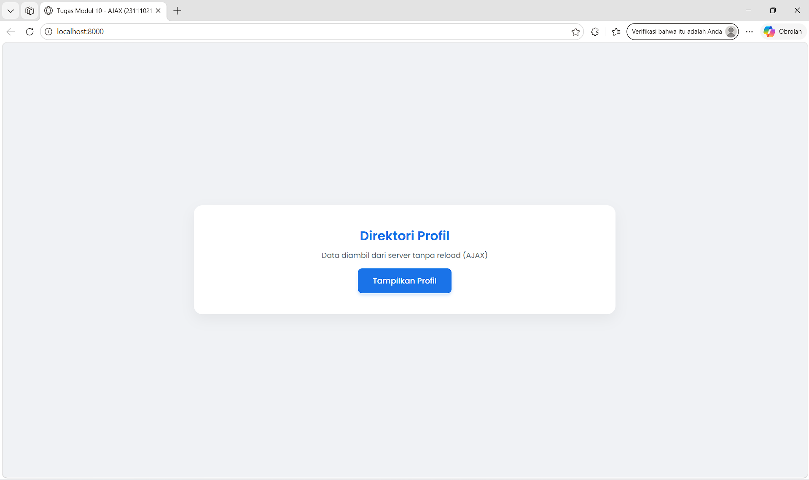
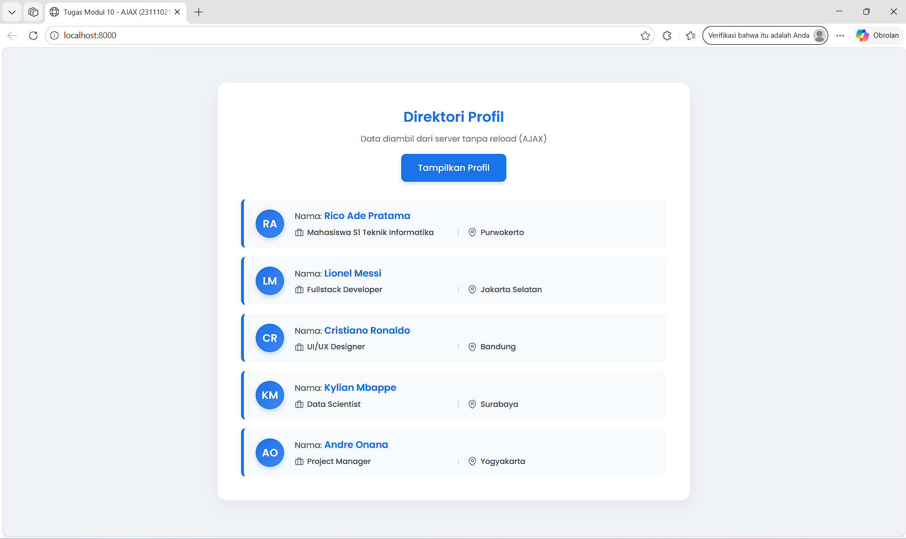

<div align="center">
   <h2>LAPORAN PRAKTIKUM<br>APLIKASI BERBASIS PLATFORM</h2>
   <h>
   <br>
   <h4>MODUL 10<br>AJAX</h4>
   <br>
   
   <br><br>
 
**Disusun Oleh :**<br>
RICO ADE PRATAMA<br>
2311102138<br>
PS1IF-11-REG01
<br><br>
 
**Dosen Pengampu :**<br>
Dimas Fanny Hebrasianto Permadi, S.ST., M.Kom
<br><br>
 
**Assisten Praktikum :**<br>
Apri Pandu Wicaksono
<br>Rangga Pradarrell Fathi
<br><br>
 
PROGRAM STUDI S1 TEKNIK INFORMATIKA<br>
FAKULTAS INFORMATIKA<br>
UNIVERSITAS TELKOM PURWOKERTO<br>
2026

</div>

---

## 1. Dasar Teori

**AJAX (Asynchronous JavaScript and XML)** adalah teknik pengembangan web yang memungkinkan pertukaran data dengan server di latar belakang. Dengan teknik ini, sebagian elemen halaman web dapat diperbarui tanpa harus memuat ulang (reload) keseluruhan halaman.

**JSON (JavaScript Object Notation)** adalah format pertukaran data standar yang ringan dan mudah diproses. Dalam PHP, data tipe array dikonversi menjadi format JSON menggunakan fungsi json_encode(). Agar respons dikenali sebagai JSON dan bukan HTML, perlu ditambahkan instruksi header('Content-Type: application/json') pada sisi server.

**Fetch API** adalah fitur bawaan JavaScript modern untuk melakukan request data HTTP secara asinkron. Fetch berjalan berbasis Promise (.then() dan .catch()), menjadikannya alternatif yang lebih bersih dan terstruktur dibandingkan metode lama seperti XMLHttpRequest.

**Event Handling dan Manipulasi DOM** adalah Interaksi pengguna, seperti mengklik tombol, ditangkap menggunakan Event Handling (contoh: addEventListener). Setelah AJAX berhasil mengambil respons JSON, JavaScript menggunakan teknik manipulasi DOM (seperti property innerHTML) untuk menyuntikkan dan menampilkan data tersebut ke dalam elemen HTML yang dituju secara dinamis.

## 2. Kode Program Unguided

_Tugas Modul 10 - Ajax_

Buat sebuah halaman web yang bisa mengambil data dari server lalu menampilkannya di halaman tanpa perlu reload.

_Instruksi Detail:_

1. _Membuat File Server_ (data.php)
   Buat file PHP yang berfungsi sebagai“database sederhana”.
   Data cukup berupa array (misalnya: nama, pekerjaan, lokasi).
   Contoh data:
   `['nama' => 'Budi', 'pekerjaan' => 'Web Developer', 'lokasi' => 'Jakarta']`
   Ubah data tersebut menjadi format JSON menggunakan `json_encode()`.
   Tampilkan hasilnya dengan `echo`.
   Jangan lupa tambahkan header: `header('Content-Type: application/json');`

2. _Membuat File Client_ (index.html)
   Buat tombol dengan teks "Tampilkan Profil".
   Siapkan tempat untuk menampilkan data, misalnya:
   `<div id="hasil-profil"></div>`
3. _Membuat Logika AJAX (JavaScript)_
   Tambahkan event ketika tombol diklik.
   Gunakan fetch() (atau boleh pakai XMLHttpRequest / jQuery AJAX) untuk mengambil data dari data.php.
   Ambil hasil response dalam bentuk JSON.

Tampilkan data tersebut ke dalam `<div id="hasil-profil">` dengan format:
_Nama: Budi | Pekerjaan: Web Developer | Lokasi: Jakarta_

### Kode HTML (index.html)

```html
<!DOCTYPE html>
<html lang="id">
  <head>
    <meta charset="UTF-8" />
    <meta name="viewport" content="width=device-width, initial-scale=1.0" />
    <title>Tugas Modul 10 - AJAX (2311102138 - RICO ADE PRATAMA)</title>
    <style>
      @import url("https://fonts.googleapis.com/css2?family=Poppins:wght@400;500;600&display=swap");

      * {
        box-sizing: border-box;
        margin: 0;
        padding: 0;
        font-family: "Poppins", sans-serif;
      }

      body {
        background-color: #f0f2f5;
        color: #333;
        display: flex;
        justify-content: center;
        align-items: center;
        min-height: 100vh;
        padding: 20px;
      }

      .container {
        background: #ffffff;
        width: 100%;
        max-width: 800px;
        padding: 40px;
        border-radius: 16px;
        box-shadow: 0 10px 25px rgba(0, 0, 0, 0.05);
        text-align: center;
      }

      .header h2 {
        color: #1a73e8;
        font-weight: 600;
        margin-bottom: 8px;
        font-size: 24px;
      }

      .header p {
        color: #6c757d;
        font-size: 14px;
        margin-bottom: 15px;
      }

      .student-badge {
        display: inline-block;
        background-color: #e8f0fe;
        color: #1a73e8;
        padding: 6px 16px;
        border-radius: 20px;
        font-size: 13px;
        font-weight: 600;
        margin-bottom: 30px;
        letter-spacing: 0.5px;
        border: 1px solid #d2e3fc;
      }

      button {
        background-color: #1a73e8;
        color: white;
        border: none;
        padding: 12px 28px;
        font-size: 15px;
        font-weight: 500;
        border-radius: 8px;
        cursor: pointer;
        transition: all 0.3s ease;
        box-shadow: 0 4px 6px rgba(26, 115, 232, 0.2);
      }

      button:hover {
        background-color: #1557b0;
        transform: translateY(-2px);
        box-shadow: 0 6px 12px rgba(26, 115, 232, 0.3);
      }

      #hasil-profil {
        margin-top: 30px;
        display: flex;
        flex-direction: column;
        gap: 15px;
        display: none;
      }

      .profil-card {
        background: #f8f9fa;
        border-left: 5px solid #1a73e8;
        padding: 16px 20px;
        border-radius: 8px;
        text-align: left;
        display: flex;
        align-items: center;
        gap: 18px;
        animation: fadeIn 0.4s ease-out forwards;
        opacity: 0;
        transition: background-color 0.2s;
      }

      .profil-card:hover {
        background-color: #f1f5f9;
      }

      .avatar {
        width: 48px;
        height: 48px;
        border-radius: 50%;
        background: linear-gradient(135deg, #1a73e8, #4285f4);
        color: white;
        display: flex;
        justify-content: center;
        align-items: center;
        font-weight: 600;
        font-size: 18px;
        flex-shrink: 0;
        box-shadow: 0 3px 8px rgba(26, 115, 232, 0.3);
      }

      .profil-info {
        display: flex;
        flex-direction: column;
        gap: 6px;
        width: 100%;
      }

      .profil-nama {
        font-size: 14px;
        color: #495057;
      }

      .profil-nama span {
        color: #1a73e8;
        font-weight: 600;
        font-size: 16px;
      }

      .profil-meta {
        display: grid;
        grid-template-columns: 260px auto 1fr;
        gap: 15px;
        font-size: 13px;
        color: #6c757d;
        align-items: center;
      }

      .meta-item {
        display: flex;
        align-items: center;
        gap: 6px;
      }

      .meta-item span.label {
        display: none;
      }

      .meta-item span.value {
        font-weight: 500;
        color: #495057;
      }

      .meta-divider {
        color: #ced4da;
        font-size: 12px;
        text-align: center;
      }

      @keyframes fadeIn {
        from {
          opacity: 0;
          transform: translateY(10px);
        }

        to {
          opacity: 1;
          transform: translateY(0);
        }
      }

      .profil-card:nth-child(1) {
        animation-delay: 0.1s;
      }

      .profil-card:nth-child(2) {
        animation-delay: 0.2s;
      }

      .profil-card:nth-child(3) {
        animation-delay: 0.3s;
      }

      .profil-card:nth-child(4) {
        animation-delay: 0.4s;
      }

      .profil-card:nth-child(5) {
        animation-delay: 0.5s;
      }
    </style>
  </head>

  <body>
    <div class="container">
      <div class="header">
        <h2>Direktori Profil</h2>
        <p>Data diambil dari server tanpa reload (AJAX)</p>
      </div>
      <button id="btn-tampil">Tampilkan Profil</button>
      <div id="hasil-profil"></div>
    </div>
    <script>
      const btn = document.getElementById("btn-tampil");
      const hasil = document.getElementById("hasil-profil");
      const svgTas = `<svg stroke="currentColor" fill="none" stroke-width="2" viewBox="0 0 24 24" height="15" width="15" style="flex-shrink:0;"><rect x="2" y="7" width="20" height="14" rx="2" ry="2"></rect><path d="M16 21V5a2 2 0 0 0-2-2h-4a2 2 0 0 0-2 2v16"></path></svg>`;
      const svgLokasi = `<svg stroke="currentColor" fill="none" stroke-width="2" viewBox="0 0 24 24" height="15" width="15" style="flex-shrink:0;"><path d="M21 10c0 7-9 13-9 13s-9-6-9-13a9 9 0 0 1 18 0z"></path><circle cx="12" cy="10" r="3"></circle></svg>`;
      function getInitials(name) {
        let words = name.trim().split(" ");
        if (words.length > 1) {
          return (words[0][0] + words[1][0]).toUpperCase();
        }
        return name.substring(0, 2).toUpperCase();
      }
      btn.addEventListener("click", function () {
        const originalText = btn.innerText;
        btn.innerText = "Memuat data...";
        fetch("data.php")
          .then((response) => response.json())
          .then((data) => {
            btn.innerText = originalText;
            hasil.style.display = "flex";
            hasil.innerHTML = "";
            data.forEach((profil) => {
              const inisial = getInitials(profil.nama);
              const card = document.createElement("div");
              card.className = "profil-card";
              card.innerHTML = `
                            <div class="avatar">${inisial}</div>
                            <div class="profil-info">
                                <div class="profil-nama">Nama: <span>${profil.nama}</span></div>
                                <div class="profil-meta">
                                    <div class="meta-item">
                                        ${svgTas} 
                                        <span class="label">Pekerjaan: </span>
                                        <span class="value">${profil.pekerjaan}</span>
                                    </div>
                                    <div class="meta-divider">|</div>
                                    <div class="meta-item">
                                        ${svgLokasi} 
                                        <span class="label">Lokasi: </span>
                                        <span class="value">${profil.lokasi}</span>
                                    </div>
                                </div>
                            </div>
                        `;
              hasil.appendChild(card);
            });
          })
          .catch((error) => {
            btn.innerText = originalText;
            alert("Terjadi kesalahan saat mengambil data!");
            console.error(error);
          });
      });
    </script>
  </body>
</html>
```

### Penjelasan Kode HTML (index.html)

Kode Program ini merupakan aplikasi web berbasis AJAX (Asynchronous JavaScript and XML) yang dirancang dengan antarmuka pengguna (UI) modern dan interaktif. Tujuan utama dari program ini adalah untuk mengambil data direktori profil dari server, dalam hal ini melalui file `data.php`. Menggunakan kombinasi HTML, CSS modern, dan JavaScript. Pada sisi tampilan antarmuka (UI), kode ini memanfaatkan teknik CSS Flexbox dan CSS Grid untuk menyusun tata letak elemen agar berada presisi di tengah layar dan responsif. Desainnya dirancang secara estetik menggunakan font "Poppins" dan mengimplementasikan gaya tata letak card (kartu) yang minimalis untuk menampilkan detail informasi profil. Selain itu, program ini juga diperkaya dengan animasi transisi halus menggunakan `@keyframes fadeIn` yang memberikan efek visual muncul perlahan ( fade-in) dengan jeda waktu yang berbeda untuk setiap kartu, serta dilengkapi dengan fungsi JavaScript untuk memotong huruf pertama pada nama agar secara dinamis diubah menjadi inisial avatar profil (ikon lingkaran).

Alur kerja kode ini sangat bergantung pada penerapan AJAX ( Asynchronous JavaScript and XML) modern yang diimplementasikan secara natif menggunakan `Fetch API`. Ketika tombol "Tampilkan Profil" diklik, JavaScript akan memicu sebuah Event Listener yang secara asinkron melakukan request (permintaan data) ke server (`data.php`) di latar belakang tanpa harus melakukan reload atau memuat ulang keseluruhan halaman web. Sembari menunggu proses tersebut, tombol akan berubah teksnya menjadi "Memuat data..." sebagai indikator antrean. Setelah server berhasil mengembalikan respons data dalam format JSON, JavaScript akan langsung menangkap data tersebut, melakukan perulangan menggunakan forEach untuk membedah masing-masing profil, merakit struktur HTML baru menggunakan Template Literals, lalu menyuntikkan (append) komponen visual tersebut secara seketika ke dalam kontainer DOM ( Document Object Model) di halaman utama.

### Kode PHP (data.php)

```php
<?php
// Tambahkan header sesuai Instruksi Detail
header('Content-Type: application/json');

// Data berupa array dengan 5 profil
$data = [
    [
        'nama' => 'Rico Ade Pratama',
        'pekerjaan' => 'Mahasiswa S1 Teknik Informatika',
        'lokasi' => 'Purwokerto'
    ],
    [
        'nama' => 'Lionel Messi',
        'pekerjaan' => 'Fullstack Developer',
        'lokasi' => 'Jakarta Selatan'
    ],
    [
        'nama' => 'Cristiano Ronaldo',
        'pekerjaan' => 'UI/UX Designer',
        'lokasi' => 'Bandung'
    ],
    [
        'nama' => 'Kylian Mbappe',
        'pekerjaan' => 'Data Scientist',
        'lokasi' => 'Surabaya'
    ],
    [
        'nama' => 'Andre Onana',
        'pekerjaan' => 'Project Manager',
        'lokasi' => 'Yogyakarta'
    ]
];

// Ubah data menjadi format JSON sesuai Instruksi Detail
echo json_encode($data);
?>
```

### Penjelasan Kode PHP (data.php)

Kode PHP di atas berfungsi sebagai "server penyedia data" atau Back-end API sederhana. Tugas utamanya adalah menyimpan sekumpulan data profil dan mengirimkannya ke sisi client (HTML/JavaScript) dalam format yang mudah diproses secara asinkron. diawali dengan perintah `header('Content-Type: application/json')` yang memodifikasi HTTP Response agar browser mengenali bahwa keluaran file tersebut murni berupa data JSON, bukan halaman web HTML biasa. Selanjutnya, program mendeklarasikan variabel `$data` yang berisi array multidimensi dengan lima buah array asosiatif di dalamnya, yang bertindak layaknya simulasi database sementara untuk menyimpan detail profil seperti `nama`, `pekerjaan`, dan `lokasi`. Pada tahap akhir, karena bahasa PHP dan JavaScript tidak bisa bertukar data mentah secara langsung, fungsi `json_encode($data)` digunakan untuk menerjemahkan array PHP tersebut menjadi teks berformat JSON, yang kemudian dicetak menggunakan perintah `echo` agar datanya siap ditangkap dan diolah oleh skrip fetch di halaman utamamu.

### Hasil Output




## 3. Kesimpulan dan Penutup

Modul ini menjelaskan konsep dasar dan implementasi AJAX beserta Fetch API untuk melakukan pertukaran data antara client dan server secara asinkron, dengan fokus materi pada pembuatan server API sederhana menggunakan PHP, pengolahan format data JSON, penanganan event, hingga manipulasi DOM tanpa perlu memuat ulang halaman (reload). Cocok digunakan sebagai panduan pembelajaran praktikum pemrograman web bagi mahasiswa program studi S1 Teknik Informatika untuk membangun situs web modern yang interaktif, cepat, dan responsif.

<br>Ngabuburit di daerah Baturraden,
<br>Sama kawan-kawan dengan motoran.
<br>Tugas Modul 10 Rico sudah absen,
<br>Siap di-push ke GitHub sebagai laporan.

## 4. Referensi

- [Materi Modul 10](https://drive.google.com/drive/folders/1ug7dmm-aVF-NG9-YT5kT519HdGmkXaD-?usp=sharing)
- [Fetch API (AJAX Asinkron)](https://developer.mozilla.org/en-US/docs/Web/API/Fetch_API/Using_Fetch)
- [Async/await](https://developer.mozilla.org/en-US/docs/Learn/JavaScript/Asynchronous/Promises)
