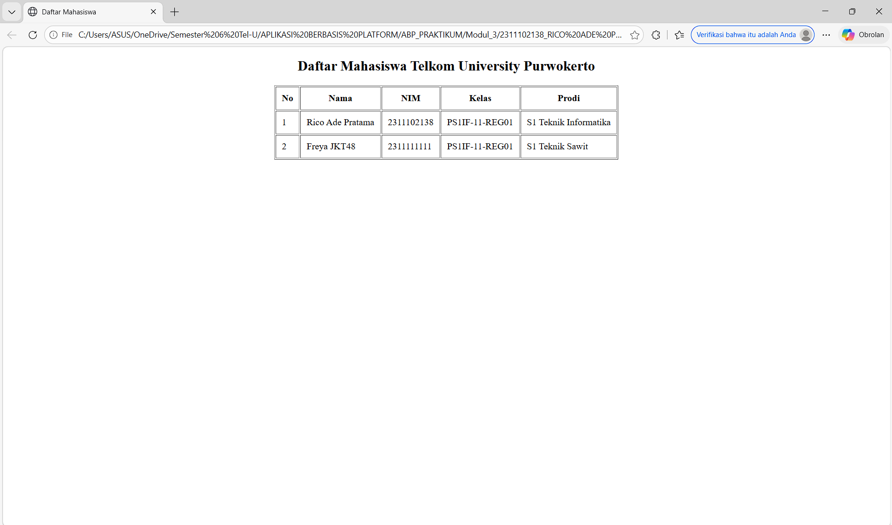

<div align="center">
  <h2>LAPORAN PRAKTIKUM<br>APLIKASI BERBASIS PLATFORM</h2>
  <h>
  <br>
  <h4>MODUL 2<br>HTML</h4>
  <br>
  
  <br><br>

**Disusun Oleh :**<br>
RICO ADE PRATAMA<br>
2311102138<br>
PS1IF-11-REG01
<br><br>

**Dosen Pengampu :**<br>
Dimas Fanny Hebrasianto Permadi, S.ST., M.Kom
<br><br>

**Assisten Praktikum :**<br>
Apri Pandu Wicaksono
<br>Rangga Pradarrell Fathi
<br><br>

PROGRAM STUDI S1 TEKNIK INFORMATIKA<br>
FAKULTAS INFORMATIKA<br>
UNIVERSITAS TELKOM PURWOKERTO<br>
2026

</div>

---

## 1. Dasar Teori

**3.1 Pengenalan HTML**<br>
HTML (HyperText Markup Language) merupakan bahasa dasar untuk membangun elemen dan struktur utama pada sebuah website . Struktur dasar HTML terdiri dari tag "html", "head", "title", dan "body".
<br>3.1.1 Tag HTML: Tag normalnya berpasangan (tag pembuka dan penutup) di mana konten diletakkan di antaranya . Namun, ada juga tag yang berdiri sendiri seperti "br".
<br>3.1.2 Elemen HTML: Merupakan tag HTML yang telah berisi konten di antara tag pembuka dan penutupnya. Konten ini bisa berupa teks atau sisipan tag HTML lainnya.
<br>3.1.3 Atribut HTML: Merupakan tambahan informasi dari sebuah tag (seperti penentuan warna atau ukuran) yang dideklarasikan pada tag pembuka dengan format nama_atribut="value" . Atribut yang paling umum digunakan adalah "id" dan "class".

**3.2 Dasar Sintaks**<br>
• Deklarasi "! DOCTYPE html" mendefinisikan dokumen menjadi HTML5
• Elemen "html" adalah elemen dasar dari halaman HTML
• Elemen "head" berisi informasi meta tentang dokumen
• Elemen "title" menentukan judul untuk dokumen
• Elemen "body" berisi konten halaman yang terlihat

**3.3 Heading**
Heading adalah tag yang berguna untuk menampilkan judul dari konten, yang juga berperan penting sebagai indeks mesin pencarian . HTML memiliki enam tingkatan heading ("h1" hingga "h6"), di mana semakin kecil nilainya, semakin besar ukurannya dan semakin penting posisinya.

**3.4 Hyperlink**<br>
Hyperlink memungkinkan halaman web bernavigasi atau berpindah ke halaman lain . Fitur ini menggunakan tag "a" dan diwajibkan menggunakan atribut href yang berisi URL halaman tujuan.

**3.5 Tabel**<br>
Elemen tabel digunakan untuk menampilkan data dalam format baris dan kolom. Tag utamanya adalah "table", yang didukung oleh pendefinisian baris menggunakan "tr", heading/judul tabel dengan "th", dan kolom/sel dengan "td". Sel pada tabel dapat digabungkan (Merge Cell) menggunakan atribut colspan dan rowspan.

**3.6 Image**<br>
Gambar dapat disisipkan menggunakan tag "img/" yang sifatnya berdiri sendiri (tanpa penutup) . Tag ini mewajibkan penggunaan atribut src yang berisi alamat letak direktori gambar tersebut disimpan.

**3.7 Audio / Video Elemen**<br>
Di HTML5, file multimedia dapat disisipkan tanpa plugin tambahan (seperti Flash Player) dengan menggunakan tag "audio" dan "video" . Tag ini dipadukan dengan tag "source" untuk memanggil alamat file media.

**3.8 Form**<br>
Formulir digunakan sebagai wadah untuk menampung dan mengumpulkan data pengguna untuk nantinya diolah atau disimpan . Pemanggilannya menggunakan tag "form" dengan atribut utama action (tujuan pengolahan data) dan method (bernilai POST atau GET).
<br>3.8.1 Elemen Form: Data diinput menggunakan berbagai tag, seperti "input/" (tipe text, password, email, radio, checkbox, submit), "select" dan "option" (untuk dropdown), serta "textarea" (untuk paragraf panjang).
<br>3.8.2 Atribut Elemen Form: Atribut yang sering digunakan untuk mengatur sifat elemen form meliputi id, name, class, placeholder, value, disabled, readonly, checked, dan selected .

## 2. Kode Program HTML

Berikut Kode Program HTML:

### Kode HTML (table.html)

```
<!DOCTYPE html>
<html>
<head>
    <title>Daftar Mahasiswa</title>
</head>
<body>
    <center>
        <h2>Daftar Mahasiswa Telkom University Purwokerto</h2>
        <table border="1" cellpadding="10">
            <tr>
                <th>No</th>
                <th>Nama</th>
                <th>NIM</th>
                <th>Kelas</th>
                <th>Prodi</th>
            </tr>
            <tr>
                <td>1</td>
                <td>Rico Ade Pratama</td>
                <td>2311102138</td>
                <td>PS1IF-11-REG01</td>
                <td>S1 Teknik Informatika</td>
            </tr>
            <tr>
                <td>2</td>
                <td>Freya JKT48</td>
                <td>2311111111</td>
                <td>PS1IF-11-REG01</td>
                <td>S1 Teknik Sawit</td>
            </tr>
        </table>
    </center>
</body>
</html>
```

### Hasil Output



### Penjelasan Kode HTML

Kode tersebut merupakan program table sederhana, pada Baris 1 terdapat "!DOCTYPE html" untuk mendefinisikan bahwa dokumen HTML5. Terdapat "html" untuk elemen dasar pembungkus seluruh halaman HTML."head" untuk menyimpan informasi meta tentang dokumen. "title" untuk menentukan judul. "body" wadah untuk semua konten terlihat oleh pengguna."center" untuk membuat posisi rata tengah. "h2" untuk membuat heading tingkat 2. "table" untuk membuat tabel, dilengkapi atribut border untuk menebalkan garis batas 1 dan cellpadding untuk memberi jarak ruang di dalam sel 10. "tr" untuk membuat baris baru di dalam tabel. "th" untuk judul kolom tabel dan teksnya otomatis tebal. "td" untuk membuat sel yang berisi data aktual tabelnya.

## 3. Kesimpulan dan Penutup

Modul ini menjelaskan tentang konsep dasar dan sintaks HTML (HyperText Markup Language) yang berfungsi sebagai kerangka utama untuk membangun sebuah halaman web, dengan table sebagai contoh utamanya. Cocok untuk pembelajaran awal mahasiswa Teknik Informatika.

<br>Ngabuburit di daerah Baturraden,
<br>Sama kawan-kawan dengan motoran.
<br>Tugas Modul 2 Rico sudah absen,
<br>Siap di-push ke GitHub sebagai laporan.

## 4. Referensi

- [Materi Modul 2](https://drive.google.com/file/d/1f-WJU1OaMIyZZZXtIissubHZ9fdcUO8y/view)
