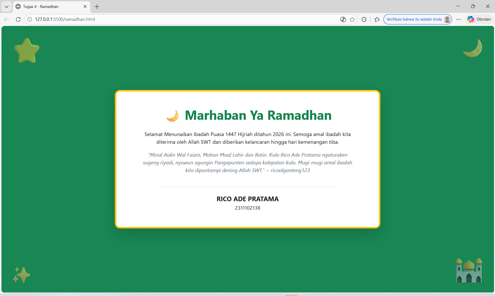

<div align="center">
   <h2>LAPORAN PRAKTIKUM<br>APLIKASI BERBASIS PLATFORM</h2>
   <h>
   <br>
   <h4>MODUL 4<br>BOOTSTRAP</h4>
   <br>
   
   <br><br>
 
**Disusun Oleh :**<br>
RICO ADE PRATAMA<br>
2311102138<br>
PS1IF-11-REG01
<br><br>
 
**Dosen Pengampu :**<br>
Dimas Fanny Hebrasianto Permadi, S.ST., M.Kom
<br><br>
 
**Assisten Praktikum :**<br>
Apri Pandu Wicaksono
<br>Rangga Pradarrell Fathi
<br><br>
 
PROGRAM STUDI S1 TEKNIK INFORMATIKA<br>
FAKULTAS INFORMATIKA<br>
UNIVERSITAS TELKOM PURWOKERTO<br>
2026

</div>

---

## 1. Dasar Teori

**Bootstrap** merupakan sebuah front-end framework gratis untuk pengembangan antar muka web yang lebih cepat dan lebih mudah. Dikembangkan oleh Mark Otto dan Jacom Thornton di Twitter dan dirilis sebagai produk open source pada Agustus 2011 di GitHub. Bootstrap mencakup template desain berbasis HTML dan CSS untuk tipografi, form, button, navigasi, modal, image carousells dan masih banyak lagi, serta terdapat opsional plugin JavaScript. Selain itu, Bootstrap memiliki kemampuan untuk membuat desain responsif yang secara otomatis menyesuaikan diri agar terlihat baik di segala perangkat, mulai dari perangkat ponsel hingga desktop pc.

**Pemasangan Bootstrap** Pemasangan dapat dilakukan dengan mengunduh file secara lokal atau memanggil Bootstrap CDN (Content Delivery Network). Penggunaan metode CDN tidak mengharuskan pengunduhan file ke dalam proyek web, namun membutuhkan koneksi internet untuk menghasilkan perubahan tampilan CSS.

**Bootstrap Container** Merupakan elemen paling dasar yang dibutuhkan dalam layouting menggunakan Bootstrap Grid. Terdapat dua class utama, yaitu ".container" untuk lebar tetap yang responsif, dan ".container-fluid" untuk lebar penuh mencakup seluruh area pandang.

**Bootstrap Grid** Sistem ini menggunakan rangkaian container, row (baris), dan column (kolom) untuk tata letak konten. Sistem grid dibangun dengan flexbox dan membagi halaman maksimal menjadi 12 kolom. Penggunaan kolom disesuaikan dengan ukuran layar menggunakan class seperti ".col-", ".col-sm-", ".col-md-", ".col-lg-", dan ".col-xl-".

**Text Style** yaitu Bootstrap menyediakan berbagai class untuk mengatur gaya teks, seperti ".text-center" (rata tengah), ".text-uppercase" (huruf kapital semua), dan ".fw-bold" (huruf tebal).

**Bootstrap Table** yaitu Tabel dipanggil menggunakan class default ".table". Tampilan tabel dapat dimodifikasi dengan class tambahan seperti ".table-hover" (warna baris berubah saat disorot) atau ".table-dark" (latar belakang gelap).

**Bootstrap Image** yaitu Penambahan class ".img-fluid" pada elemen HTML "img" membuat ukuran gambar menjadi responsif menyesuaikan ukuran container atau wadahnya.

**Bootstrap Button** Tampilan tombol standar ".btn" dapat dirubah warna dan ukurannya dengan class tambahan seperti ".btn-primary" untuk desain utama atau .btn-lg untuk ukuran besar.

**Bootstrap Form** Class ".form-control" digunakan pada elemen input untuk memberikan styling yang konsisten. Tata letak form dapat diatur secara vertikal (default), inline (satu baris), atau horizontal (menggunakan sistem grid dengan class ".row" dan ".col-\*").

## 2. Kode Program Unguided

Tugas 4, Buat halaman ramadan dan gunakan bootstrap (sebisa mungkin tanpa meggunakan native css full bootstap)

### Kode HTML (ramadhan.html)

```html
<!DOCTYPE html>
<html lang="id">
  <head>
    <meta charset="UTF-8" />
    <meta name="viewport" content="width=device-width, initial-scale=1.0" />
    <title>Tugas 4 - Ramadhan</title>
    <link
      href="https://cdn.jsdelivr.net/npm/bootstrap@5.3.0/dist/css/bootstrap.min.css"
      rel="stylesheet"
    />
  </head>
  <body
    class="bg-success min-vh-100 d-flex justify-content-center align-items-center position-relative overflow-hidden text-center"
  >
    <div class="position-absolute top-0 start-0 m-4 display-1 opacity-50">
      ⭐
    </div>
    <div class="position-absolute top-0 end-0 m-4 display-3 opacity-50">🌙</div>
    <div class="position-absolute bottom-0 start-0 m-4 display-4 opacity-50">
      ✨
    </div>
    <div class="position-absolute bottom-0 end-0 m-4 display-1 opacity-50">
      🕌
    </div>
    <div class="container">
      <div class="row justify-content-center">
        <div class="col-12 col-md-10 col-lg-8">
          <div
            class="card shadow-lg border border-5 border-warning rounded-4 bg-white p-4 p-md-5 mx-3"
          >
            <h1 class="display-6 fw-bold text-success mb-4">
              🌙 Marhaban Ya Ramadhan
            </h1>
            <p class="text-dark fs-6 mb-3 px-md-3">
              Selamat Menunaikan Ibadah Puasa 1447 Hijriah ditahun 2026 ini.
              Semoga amal ibadah kita diterima oleh Allah SWT dan diberikan
              kelancaran hingga hari kemenangan tiba.
            </p>
            <p class="text-secondary fst-italic mb-4 px-md-4">
              "Minal Aidin Wal Faizin, Mohon Maaf Lahir dan Batin. Kulo Rico Ade
              Pratama ngaturaken sugeng riyadi, nyuwun agungin Pangapunten
              sedaya kalepatan kulo. Mugi-mugi amal ibadah kita dipuntampi
              dening Allah SWT." ~ ricoolganteng123
            </p>
            <hr class="border-success opacity-25 w-75 mx-auto mb-4" />
            <div>
              <h5 class="fw-bold text-dark mb-1">RICO ADE PRATAMA</h5>
              <p class="text-secondary fw-semibold mb-0">2311102138</p>
            </div>
          </div>
        </div>
      </div>
    </div>
  </body>
</html>
```

### Hasil Output



### Penjelasan Kode HTML

Kode HTML yang saya bikin merupakan implementasi antarmuka web responsif yang memanfaatkan kerangka kerja Bootstrap melalui pemanggilan CDN , di mana struktur utamanya dibangun dengan sistem grid menggunakan elemen ".container", ".row", dan kelas ".col-12", ".col-md-10", ".col-lg-8" untuk memastikan kartu ucapan dapat menyesuaikan diri secara otomatis dan berada tepat di tengah layar pada berbagai ukuran perangkat. Tampilan visual dan tata letak halaman ini diperkaya dengan utility classes tingkat lanjut seperti flexbox "d-flex", "justify-content-center", "align-items-center" pada bagian "body" serta positioning "position-absolute" untuk menyematkan dekorasi ornamen emoji secara bebas di sudut-sudut layar, sementara gaya tipografi pada konten di dalam kartu dikelola secara praktis menggunakan kelas text style bawaan Bootstrap seperti ".text-center" untuk perataan teks ke tengah, ".fw-bold" untuk menebalkan huruf pada judul, dan ".fst-italic" untuk memberikan efek huruf miring pada kalimat kutipan permohonan maaf. Lebih jelasnya yang outputnya seperti pada gambar diatas.

## 3. Kesimpulan dan Penutup

Modul ini menjelaskan tentang konsep dasar dan implementasi Bootstrap sebagai front-end framework untuk pengembangan antarmuka web yang lebih cepat dan responsif , dengan sistem grid, gaya teks, tabel, gambar, tombol, serta formulir sebagai fokus materi utamanya. Cocok digunakan sebagai panduan pembelajaran praktikum pemrograman web bagi mahasiswa program studi Informatika di Telkom University Purwokerto untuk membangun tata letak situs web portofolio yang modern dan rapi di berbagai perangkat.

<br>Ngabuburit di daerah Baturraden,
<br>Sama kawan-kawan dengan motoran.
<br>Tugas Modul 4 Rico sudah absen,
<br>Siap di-push ke GitHub sebagai laporan.

## 4. Referensi

- [Materi Modul 4](https://drive.google.com/file/d/1Qxsa7wNn3PNrDLYzgBKb62GZi4mPkoub/view)
