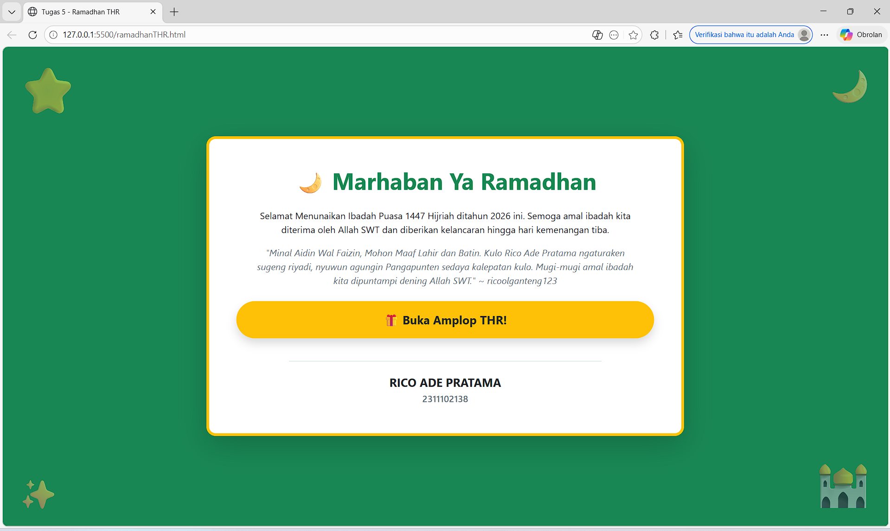
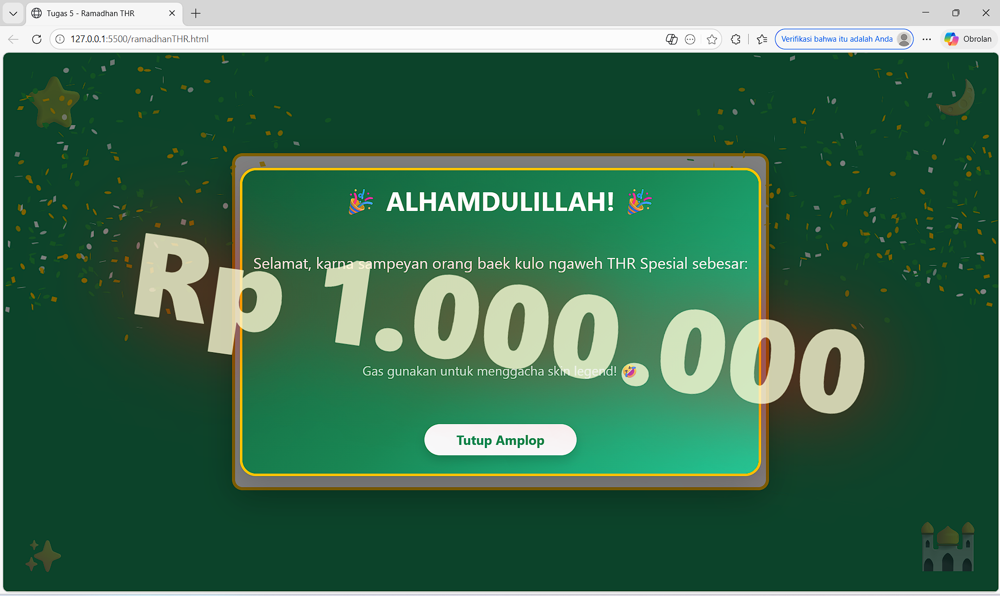

<div align="center">
   <h2>LAPORAN PRAKTIKUM<br>APLIKASI BERBASIS PLATFORM</h2>
   <h>
   <br>
   <h4>MODUL 5<br>JAVASCRIPT & JQUERY</h4>
   <br>
   
   <br><br>
 
**Disusun Oleh :**<br>
RICO ADE PRATAMA<br>
2311102138<br>
PS1IF-11-REG01
<br><br>
 
**Dosen Pengampu :**<br>
Dimas Fanny Hebrasianto Permadi, S.ST., M.Kom
<br><br>
 
**Assisten Praktikum :**<br>
Apri Pandu Wicaksono
<br>Rangga Pradarrell Fathi
<br><br>
 
PROGRAM STUDI S1 TEKNIK INFORMATIKA<br>
FAKULTAS INFORMATIKA<br>
UNIVERSITAS TELKOM PURWOKERTO<br>
2026

</div>

---

## 1. Dasar Teori

**Javascript** merupakan bahasa pemrograman scripting yang digunakan untuk mengubah dokumen HTML statis menjadi dinamis dan interaktif, umumnya digunakan hanya untuk program yang tidak terlalu besar, biasanya hanya beberapa ratus baris, dan mengontrol program yang berbasis Java. Pada dasarnya Javascript tidak dirancang untuk digunakan dalam aplikasi skala besar.

**Prinsip Dasar Javascript** terdapat pada bahasa pemrograman javascript adalah sebagai berikut.

1. Javascript mendukung paradigma pemrograman imparatif (Javascript dapat menjalankan perintah program baris demi baris, dengan masing-masing baris berisi satu atau lebih perintah), fungsional (struktur dan elemen-elemen dalam program sebagai fungsi matematis yang tidak memiliki keadaan (state) dan data yang dapat berubah (mutable data)), dan orientasi objek (segala sesuatu yang terlibat dalam program dapat disebut sebagai "objek").
2. Javascript memiliki model pemrograman fungsional yang sangat ekspresif.
3. Pemrograman berorientasi objek (PBO) pada Javascript memiliki perbedaan dari PBO pada umumnya.
4. Program kompleks pada Javascript umumnya dipandang sebagai program-program kecil yang saling berinteraksi.

**Tipe data dasar** Seperti kebanyakan bahasa pemrograman lainnya, Javascript memiliki beberapa tipe data untuk dimanipulasi. Seluruh nilai yang ada dalam Javascript selalu memiliki tipe data. Tipe data yang dimiliki oleh
Javascript adalah sebagai berikut:
• Number (bilangan)
• String (serangkaian karakter)
• Boolean (benar / salah)
• Object
• Function (fungsi)
• Array
• Date
• RegExp (regular expression)
• Null (tidak berlaku / kosong)
• Undefined (tidak didefinisikan)

**Variabel** dideklarasikan dengan "var" dan tipe datanya dapat berubah secara dinamis. JavaScript memiliki tipe data seperti "Number", "String", "Boolean", "Object", "Function", "Array", "Date", "RegExp", "Null", dan "Undefined".

**Array** Tipe khusus (mirip objek) untuk menampung banyak nilai (termasuk beda tipe data) yang diakses menggunakan indeks mulai dari 0. Memiliki method bawaan seperti "push()", "pop()", dan properti "length".

**Pengendalian Struktur** Menggunakan "if"/"else" untuk percabangan serta "for", "while", dan "do-while" untuk perulangan. Evaluasi data yang paling akurat menggunakan operator "===" untuk memastikan tipe data dan nilai sama.

**Objek** Merupakan sekumpulan properti yang dapat berubah nilainya (mutable properties collection). Dibuat menggunakan kurung kurawal "{}" atau object literal. Nilai objek diakses menggunakan tanda kurung siku "[]" atau titik "." . Pewarisan objek pada JavaScript tidak menggunakan kelas, melainkan prototipe melalui fungsi "Object.create".

**Function** Digunakan untuk menyimpan perintah agar dapat digunakan ulang (code reuse) dan menyembunyikan informasi. Dapat dibuat dengan nama (function declaration) maupun tanpa nama / fungsi anonim (function expression). Fungsi mengembalikan nilai dan akan langsung berhenti bekerja ketika program menemukan kata kunci "return".

**Pengenalan dan Penggunaan jQuery** Library JavaScript ringan yang menyederhanakan manipulasi dokumen HTML hanya dengan beberapa baris kode. Memudahkan manipulasi DOM, penanganan event (seperti klik pengguna), dukungan AJAX, dan pembuatan animasi. Dapat diimplementasikan melalui file lokal (download) atau menggunakan Content Delivery Network (CDN). Mampu mengelola efek tampilan seperti menampilkan "show" atau menyembunyikan "hide" elemen HTML, serta menerapkan efek animasi seperti "toggle" Pada elemen.

## 2. Kode Program Unguided

Tugas 5, Buka kembali halaman ramadan dan tambahkan button atau semacam nya ketika di klik akan menampilkan modal "selamat anda mendapatkan THR" buat se interaktif itu dan sebagus mungkin.

### Kode HTML (ramadhan.html)

```html
<!DOCTYPE html>
<html lang="id">
  <head>
    <meta charset="UTF-8" />
    <meta name="viewport" content="width=device-width, initial-scale=1.0" />
    <title>Tugas 5 - Ramadhan THR</title>
    <link
      href="https://cdn.jsdelivr.net/npm/bootstrap@5.3.0/dist/css/bootstrap.min.css"
      rel="stylesheet"
    />
    <script src="https://code.jquery.com/jquery-3.7.1.min.js"></script>
    <script src="https://cdn.jsdelivr.net/npm/canvas-confetti@1.6.0/dist/confetti.browser.min.js"></script>
    <style>
      .modal-custom {
        background: linear-gradient(135deg, #115d38, #198754, #20c997);
        border: 4px solid #ffc107;
        border-radius: 25px;
        color: white;
        box-shadow: 0 0 30px rgba(255, 193, 7, 0.5);
      }
      /* 2311102138_RICO ADE PRATAMA */
      .thr-amount {
        font-size: 3.5rem;
        font-weight: 900;
        color: #ffc107;
        display: none;
        opacity: 0;
      }
      /* 1. Animasi tombol berdenyut */
      @keyframes pulseGlow {
        0% {
          box-shadow: 0 0 0 0 rgba(255, 193, 7, 0.7);
          transform: scale(1);
        }
        50% {
          box-shadow: 0 0 0 15px rgba(255, 193, 7, 0);
          transform: scale(1.05);
        }
        100% {
          box-shadow: 0 0 0 0 rgba(255, 193, 7, 0);
          transform: scale(1);
        }
      }
      .btn-glow {
        animation: pulseGlow 2s infinite;
        transition: all 0.3s ease;
      }
      .btn-glow:hover {
        animation: none;
        transform: scale(1.1) translateY(-5px);
        box-shadow: 0 10px 20px rgba(0, 0, 0, 0.3);
      }

      /* 2. Animasi Jumpscare untuk Nominal THR */
      @keyframes jumpscareReveal {
        0% {
          transform: scale(0);
          opacity: 0;
        }
        30% {
          transform: scale(4) rotate(10deg);
          opacity: 1;
          text-shadow: 0 0 50px red;
          color: white;
        }
        50% {
          transform: scale(0.8) rotate(-5deg);
          color: #ffc107;
          text-shadow: none;
        }
        70% {
          transform: scale(1.1) rotate(2deg);
        }
        100% {
          transform: scale(1) rotate(0deg);
          opacity: 1;
          text-shadow:
            2px 4px 8px rgba(0, 0, 0, 0.4),
            0 0 15px #ffc107;
        }
      }
      .animate-jumpscare {
        display: block !important;
        animation: jumpscareReveal 0.5s cubic-bezier(0.25, 1, 0.5, 1) forwards;
      }
    </style>
  </head>
  <body
    class="bg-success min-vh-100 d-flex justify-content-center align-items-center position-relative overflow-hidden text-center"
  >
    <div class="position-absolute top-0 start-0 m-4 display-1 opacity-50">
      ⭐
    </div>
    <div class="position-absolute top-0 end-0 m-4 display-3 opacity-50">🌙</div>
    <div class="position-absolute bottom-0 start-0 m-4 display-4 opacity-50">
      ✨
    </div>
    <div class="position-absolute bottom-0 end-0 m-4 display-1 opacity-50">
      🕌
    </div>
    <div class="container">
      <div class="row justify-content-center">
        <div class="col-12 col-md-10 col-lg-8">
          <div
            class="card shadow-lg border border-5 border-warning rounded-4 bg-white p-4 p-md-5 mx-3"
          >
            <h1 class="display-6 fw-bold text-success mb-4">
              🌙 Marhaban Ya Ramadhan
            </h1>
            <p class="text-dark fs-6 mb-3 px-md-3">
              Selamat Menunaikan Ibadah Puasa 1447 Hijriah ditahun 2026 ini.
              Semoga amal ibadah kita diterima oleh Allah SWT dan diberikan
              kelancaran hingga hari kemenangan tiba.
            </p>
            <p class="text-secondary fst-italic mb-4 px-md-4">
              "Minal Aidin Wal Faizin, Mohon Maaf Lahir dan Batin. Kulo Rico Ade
              Pratama ngaturaken sugeng riyadi, nyuwun agungin Pangapunten
              sedaya kalepatan kulo. Mugi-mugi amal ibadah kita dipuntampi
              dening Allah SWT." ~ ricoolganteng123
            </p>
            <button
              type="button"
              class="btn btn-warning btn-lg fw-bold shadow rounded-pill px-5 py-3 mb-4 text-dark btn-glow"
              data-bs-toggle="modal"
              data-bs-target="#thrModal"
              id="btnThr"
            >
              🎁 Buka Amplop THR!
            </button>
            <hr class="border-success opacity-25 w-75 mx-auto mb-4" />
            <div>
              <h5 class="fw-bold text-dark mb-1">RICO ADE PRATAMA</h5>
              <p class="text-secondary fw-semibold mb-0">2311102138</p>
            </div>
          </div>
        </div>
      </div>
    </div>
    <div
      class="modal fade"
      id="thrModal"
      tabindex="-1"
      aria-labelledby="thrModalLabel"
      aria-hidden="true"
    >
      <div class="modal-dialog modal-dialog-centered modal-lg">
        <div class="modal-content modal-custom shadow-lg">
          <div class="modal-header border-0 pb-0 justify-content-center">
            <h2 class="modal-title fw-bold display-6" id="thrModalLabel">
              🎉 ALHAMDULILLAH! 🎉
            </h2>
          </div>
          <div class="modal-body text-center py-5">
            <p class="fs-4 mb-3 text-light">
              Selamat, karna sampeyan orang baek kulo ngaweh THR Spesial
              sebesar:
            </p>
            <div class="thr-amount my-4" id="nominalThr">Rp 1.000.000</div>
            <p class="mt-4 fs-5 text-light opacity-75">
              Gas gunakan untuk menggacha skin legend! 🤣
            </p>
          </div>
          <div class="modal-footer border-0 pt-0 justify-content-center pb-4">
            <button
              type="button"
              class="btn btn-light btn-lg rounded-pill fw-bold px-5 text-success shadow"
              data-bs-dismiss="modal"
            >
              Tutup Amplop
            </button>
          </div>
        </div>
      </div>
    </div>
    <script src="https://cdn.jsdelivr.net/npm/bootstrap@5.3.0/dist/js/bootstrap.bundle.min.js"></script>
    <script type="text/javascript">
      $(document).ready(function () {
        /* 3. Efek Confetti saat tombol diklik */
        $("#btnThr").on("click", function () {
          var duration = 3000;
          var end = Date.now() + duration;
          (function frame() {
            confetti({
              particleCount: 5,
              angle: 60,
              spread: 55,
              origin: { x: 0 },
              colors: ["#ffc107", "#28a745", "#ffffff"],
            });
            confetti({
              particleCount: 5,
              angle: 120,
              spread: 55,
              origin: { x: 1 },
              colors: ["#ffc107", "#28a745", "#ffffff"],
            });
            if (Date.now() < end) {
              requestAnimationFrame(frame);
            }
          })();
        });
        /* 2311102138_RICO ADE PRATAMA */
        $("#thrModal").on("show.bs.modal", function () {
          $("#nominalThr").removeClass("animate-jumpscare").hide();
        });
        $("#thrModal").on("shown.bs.modal", function () {
          setTimeout(function () {
            $("#nominalThr").addClass("animate-jumpscare");
          }, 400);
        });
        $("#thrModal").on("hidden.bs.modal", function () {
          $("#nominalThr").removeClass("animate-jumpscare").hide();
        });
      });
    </script>
  </body>
</html>
```

### Hasil Output




### Penjelasan Kode HTML

Kode HTML yang saya bikin ini merupakan lanjutan kode praktikum kemarin yang merupakan implementasi Program sebuah halaman web interaktif bertema ucapan Ramadhan dan bagi-bagi THR yang dibangun menggunakan kombinasi HTML, framework Bootstrap 5, CSS khusus, serta Javascript (jQuery). Halaman utamanya masih seperti tempilan program kemarin, sebuah kartu ucapan dengan latar belakang bernuansa hijau lengkap dengan ornamen, di mana terdapat sebuah tombol bertuliskan "Buka Amplop THR!". Tombol tersebut dibuat lebih hidup menggunakan animasi CSS keyframes (pulseGlow) yang membuatnya terus berdenyut agar menarik perhatian pengguna.

Ketika pengguna mengklik tombol tersebut, program akan mengeksekusi dua aksi utama melalui Javascript. Pertama, fungsi dari library eksternal Canvas Confetti dipanggil untuk menembakkan efek potongan kertas warna-warni menciptakan nuansa perayaan. Kedua, sebuah komponen Modal dari Bootstrap akan muncul ke tengah layar. Dengan memanfaatkan fungsi Event Handling pada jQuery, program memberikan jeda waktu (delay) sekitar 400 milidetik setelah modal terbuka penuh sebelum menyisipkan class animasi pada teks nominal uangnya. Hal ini memicu efek jumpscare menggunakan CSS (jumpscareReveal), di mana angka "Rp 1.000.000" akan tiba-tiba membesar secara ekstrem dan berwarna merah sekilas sebelum kembali mengecil ke ukuran normal. Terakhir, jQuery juga diatur untuk me-reset atau menghapus class animasi tersebut setiap kali modal ditutup, sehingga seluruh efek interaktif dapat diulang kembali dengan sempurna saat tombol diklik lagi. Lebih jelasnya yang outputnya seperti pada gambar diatas.

## 3. Kesimpulan dan Penutup

Modul ini menjelaskan konsep dasar dan implementasi Javascript beserta library jQuery untuk mengubah dokumen HTML statis menjadi dinamis dan interaktif , dengan fokus materi pada pemahaman sintaks dasar, fungsi, orientasi objek, hingga manipulasi DOM dan efek animasi. Cocok digunakan sebagai panduan pembelajaran praktikum pemrograman web bagi mahasiswa program studi Informatika di Telkom University Purwokerto untuk membangun situs web modern.

<br>Ngabuburit di daerah Baturraden,
<br>Sama kawan-kawan dengan motoran.
<br>Tugas Modul 5 Rico sudah absen,
<br>Siap di-push ke GitHub sebagai laporan.

## 4. Referensi

- [Materi Modul 4](https://drive.google.com/file/d/1Qxsa7wNn3PNrDLYzgBKb62GZi4mPkoub/view)
