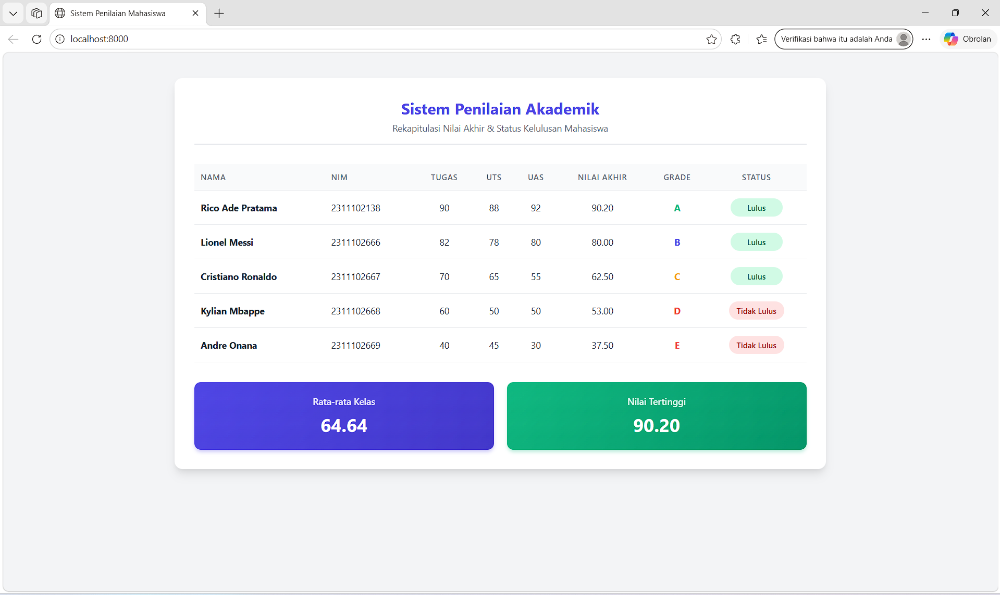

<div align="center">
   <h2>LAPORAN PRAKTIKUM<br>APLIKASI BERBASIS PLATFORM</h2>
   <h>
   <br>
   <h4>MODUL 9<br>PHP</h4>
   <br>
   
   <br><br>
 
**Disusun Oleh :**<br>
RICO ADE PRATAMA<br>
2311102138<br>
PS1IF-11-REG01
<br><br>
 
**Dosen Pengampu :**<br>
Dimas Fanny Hebrasianto Permadi, S.ST., M.Kom
<br><br>
 
**Assisten Praktikum :**<br>
Apri Pandu Wicaksono
<br>Rangga Pradarrell Fathi
<br><br>
 
PROGRAM STUDI S1 TEKNIK INFORMATIKA<br>
FAKULTAS INFORMATIKA<br>
UNIVERSITAS TELKOM PURWOKERTO<br>
2026

</div>

---

## 1. Dasar Teori

**Web Server** merupakan sebuah perangkat lunak dalam server yang berfungsi menerima permintaan (request) berupa halaman web melalui HTTP atau HTTPS dari client yang dikenal dengan web browser dan mengirimkan kembali (response) hasilnya dalam bentuk halaman-halaman web yang umumnya berbentuk dokumen HTML.

**Server Side Scripting** merupakan sebuah teknologi scripting atau pemrograman web dimana script (program) dikompilasi atau diterjemahkan di server. Dengan server side scripting, memungkinkan untuk menghasilkan halaman web yang dinamis.

**Pengenalan PHP**
Merupakan singkatan rekursif dari PHP : Hypertext Preprocessor. Pertama kali diciptakan oleh Rasmus
Lerdorf pada tahun 1994. PHP sendiri harus ditulis diantara tag :

- `<? dan ?>PEMROGRAMAN WEB 58`
- `<?php dan ?>`
- `<script language=”php”> dan </script>`
- `<% dan %>`

Setiap satu statement (perintah) biasanya diakhiri dengan titik-koma (;). PHP juga case sensitive untuk nama identifier yang dibuat oleh user sedangkan identifier bawaan dari PHP tidak case sensitive. Contoh program yang ditulis dengan bahasa PHP `<?php echo “Hello World!”; ?>` Simpan file tersebut dengan nama hello.php pada direktori htdocs yang ada di folder XAMPP. Kemudian, jalankan pada browser dengan mengetikkan alamat http://localhost/hello.php . Hasilnya akan muncul di web browser.

**Variabel** digunakan untuk menyimpan sebuah value (nilai), data atau informasi. Nama variabel pada PHP diawali dengan tanda `$`. Panjang dari suatu variabel tidak terbatas dan variabel tidak perlu dideklarasi terlebih dahulu sebelumnya. Setelah tanda `$`, dapat diawali dengan huruf atau under-score (`\_`). Karakter berikutnya bisa terdiri dari huruf, angka dan atau karakter tertentu yang diperbolehkan (karakter ASCII dari `127 – 255`). Variabel pada PHP bersifat case sensitive artinya besar kecilnya suatu karakter berpengaruh pada variabel tersebut. Suatu karakter pada PHP tidak boleh mengandung spasi. Pada PHP, tipe data dari suatu variabel tidak didefinisikan langsung oleh programmer, akan tetapi secara otomatis akan ditentukan oleh interpreter PHP. Namun demikian, PHP mendukung 8 (delapan) buah tipe data primitif, yaitu:

1. Boolean
2. Integer
3. Float
4. String
5. Array
6. Object
7. Resource
8. NULL.

**Konstanta** Konstanta merupakan variabel konstan yang nilainya tidak berubah-ubah. Untuk mendefinisikan konstanta pada PHP, dapat menggunakan fungsi define() yang telah tersedia pada PHP.

**Struktur Kondisi** Struktur kondisi pada PHP sama halnya dengan bahasa pemrograman lainnya seperti Java.

**Perulangan (Looping)**
Banyak jenis perulangan yang terdapat pada PHP. Adapun beberapa diantaranya adalah :

1. Perulangan for
2. Perulangan while
3. Perulangan do-while
4. Perulangan foreach

**Function** Dalam merancang kode program, kadang kita sering membuat kode yang melakukan tugas yang sama secara berulang-ulang, seperti membaca tabel dari database, menampilkan penjumlahan, dan lainlain. Tugas yang sama ini akan lebih efektif jika dipisahkan dari program utama, dan dirancang menjadi sebuah fungsi. Fungsi dipanggil dengan menulis nama dari fungsi tersebut, dan diikuti dengan argumen (jika ada). Argumen ditulis di dalam tanda kurung, dan jika jumlah argumen lebih dari satu, maka diantaranya dipisahkan oleh karakter koma.

**Array** merupakan tipe data terstruktur yang berguna untuk menyimpan sejumlah data yang bertipe sama. Bagian yang menyusun array disebut elemen array, yang masing-masing elemen dapat diakses tersendiri melalui index array. Index array dapat berupa bilangan integer atau string. Untuk mendeklarasikan atau mendefinisikan sebuah array di PHP bisa menggunakan keyword array(). Jumlah elemen array tidak perlu disebutkan saat deklarasi. Sedangkan untuk menampilkan isi array pada
elemen tertentu, cukup dengan menyebutkan nama array beserta index array-nya.

## 2. Kode Program Unguided

_Tugas Modul 9 - PHP: Buat Sistem Penilaian Mahasiswa_

_Deskripsi_

Buat program PHP sederhana untuk menampilkan data beberapa mahasiswa, menghitung nilai akhir, menentukan grade, dan status kelulusan.

_Ketentuan_

- Gunakan array Asosiasi untuk menyimpan minimal 3 data mahasiswa

_Setiap mahasiswa punya:_

- nama
- nim
- nilai tugas
- nilai uts
- nilai uas
- Gunakan function untuk menghitung nilai akhir
- Gunakan if/else atau switch untuk menentukan grade
- Gunakan operator aritmatika untuk perhitungan nilai akhir
- Gunakan operator perbandingan untuk menentukan lulus/tidak
- Gunakan loop untuk menampilkan seluruh data
- Tampilkan hasil dalam bentuk tabel HTML

_Output minimal_

- Nama
- NIM
- Nilai akhir
- Grade
- Status
- Tampilkan rata-rata kelas
- Tampilkan nilai tertinggi

_note: Jangan lupa source code serta SS hasil disertakan di repository github masing-masing yahh_

### Kode PHP (index.php)

```php
<!DOCTYPE html>
<html lang="id">
<head>
    <meta charset="UTF-8">
    <meta name="viewport" content="width=device-width, initial-scale=1.0">
    <title>Sistem Penilaian Mahasiswa</title>
    <style>
        :root {
            --primary: #4f46e5;
            --primary-hover: #4338ca;
            --success: #10b981;
            --danger: #ef4444;
            --warning: #f59e0b;
            --bg-color: #f3f4f6;
            --card-bg: #ffffff;
            --text-main: #1f2937;
            --text-muted: #6b7280;
        }

        * {
            box-sizing: border-box;
            margin: 0;
            padding: 0;
            font-family: 'Segoe UI', Tahoma, Geneva, Verdana, sans-serif;
        }

        body {
            background-color: var(--bg-color);
            color: var(--text-main);
            padding: 40px 20px;
            display: flex;
            justify-content: center;
        }

        .container {
            background-color: var(--card-bg);
            width: 100%;
            max-width: 1000px; /* Diperlebar sedikit karena kolom bertambah */
            border-radius: 12px;
            box-shadow: 0 10px 15px -3px rgba(0, 0, 0, 0.1), 0 4px 6px -2px rgba(0, 0, 0, 0.05);
            padding: 30px;
            animation: fadeIn 0.5s ease-in-out;
        }

        @keyframes fadeIn {
            from { opacity: 0; transform: translateY(10px); }
            to { opacity: 1; transform: translateY(0); }
        }

        .header {
            text-align: center;
            margin-bottom: 30px;
            padding-bottom: 15px;
            border-bottom: 2px solid #e5e7eb;
        }

        .header h2 {
            color: var(--primary);
            font-size: 24px;
            margin-bottom: 5px;
        }

        .header p {
            color: var(--text-muted);
            font-size: 14px;
        }

        table {
            width: 100%;
            border-collapse: collapse;
            margin-bottom: 30px;
        }

        th, td {
            padding: 12px 10px;
            text-align: left;
            border-bottom: 1px solid #e5e7eb;
            font-size: 14px;
        }

        th {
            background-color: #f9fafb;
            color: var(--text-muted);
            font-weight: 600;
            text-transform: uppercase;
            font-size: 12px;
            letter-spacing: 0.05em;
        }

        tbody tr:hover {
            background-color: #f9fafb;
            transition: background-color 0.2s;
        }

        .text-center { text-align: center; }

        /* Styling Badges */
        .badge {
            padding: 6px 12px;
            border-radius: 20px;
            font-size: 12px;
            font-weight: 600;
            display: inline-block;
            text-align: center;
            min-width: 80px;
        }

        .badge-lulus { background-color: #d1fae5; color: #065f46; }
        .badge-gagal { background-color: #fee2e2; color: #991b1b; }

        .grade-a { color: var(--success); font-weight: bold; }
        .grade-b { color: var(--primary); font-weight: bold; }
        .grade-c { color: var(--warning); font-weight: bold; }
        .grade-d, .grade-e { color: var(--danger); font-weight: bold; }

        /* Summary Cards */
        .summary-container {
            display: flex;
            gap: 20px;
            justify-content: space-between;
        }

        .summary-card {
            flex: 1;
            background: linear-gradient(135deg, var(--primary), var(--primary-hover));
            color: white;
            padding: 20px;
            border-radius: 10px;
            text-align: center;
            box-shadow: 0 4px 6px -1px rgba(79, 70, 229, 0.3);
        }

        .summary-card.highest {
            background: linear-gradient(135deg, var(--success), #059669);
            box-shadow: 0 4px 6px -1px rgba(16, 185, 129, 0.3);
        }

        .summary-card h4 {
            font-size: 14px;
            font-weight: 500;
            opacity: 0.9;
            margin-bottom: 8px;
        }

        .summary-card .value {
            font-size: 28px;
            font-weight: 700;
        }

    </style>
</head>
<body>

    <div class="container">
        <div class="header">
            <h2>Sistem Penilaian Akademik</h2>
            <p>Rekapitulasi Nilai Akhir & Status Kelulusan Mahasiswa</p>
        </div>

        <?php
        // 1. Array Asosiasi dengan 5 Mahasiswa (Grade A, B, C, D, E)
        $data_mahasiswa = [
            [
                "nama" => "Rico Ade Pratama", // Grade A
                "nim" => "2311102138",
                "nilai_tugas" => 90,
                "nilai_uts" => 88,
                "nilai_uas" => 92
            ],
            [
                "nama" => "Lionel Messi", // Grade B
                "nim" => "2311102666",
                "nilai_tugas" => 82,
                "nilai_uts" => 78,
                "nilai_uas" => 80
            ],
            [
                "nama" => "Cristiano Ronaldo", // Grade C
                "nim" => "2311102667",
                "nilai_tugas" => 70,
                "nilai_uts" => 65,
                "nilai_uas" => 55
            ],
            [
                "nama" => "Kylian Mbappe", // Grade D
                "nim" => "2311102668",
                "nilai_tugas" => 60,
                "nilai_uts" => 50,
                "nilai_uas" => 50
            ],
            [
                "nama" => "Andre Onana", // Grade E
                "nim" => "2311102669",
                "nilai_tugas" => 40,
                "nilai_uts" => 45,
                "nilai_uas" => 30
            ]
        ];

        // 2. Function & Operator Aritmatika (Tugas 30%, UTS 30%, UAS 40%)
        function hitungNilaiAkhir($tugas, $uts, $uas) {
            return ($tugas * 0.30) + ($uts * 0.30) + ($uas * 0.40);
        }

        // 3. Function & If/Else untuk Grade
        function tentukanGrade($nilaiAkhir) {
            if ($nilaiAkhir >= 85) {
                return ["grade" => "A", "class" => "grade-a"];
            } elseif ($nilaiAkhir >= 75) {
                return ["grade" => "B", "class" => "grade-b"];
            } elseif ($nilaiAkhir >= 60) {
                return ["grade" => "C", "class" => "grade-c"];
            } elseif ($nilaiAkhir >= 50) {
                return ["grade" => "D", "class" => "grade-d"];
            } else {
                return ["grade" => "E", "class" => "grade-e"];
            }
        }

        $total_nilai_kelas = 0;
        $nilai_tertinggi = 0;
        $jumlah_mahasiswa = count($data_mahasiswa);

        echo "<table>";
        // Tambahkan kolom Tugas, UTS, UAS di Header Tabel
        echo "<thead>
                <tr>
                    <th>Nama</th>
                    <th>NIM</th>
                    <th class='text-center'>Tugas</th>
                    <th class='text-center'>UTS</th>
                    <th class='text-center'>UAS</th>
                    <th class='text-center'>Nilai Akhir</th>
                    <th class='text-center'>Grade</th>
                    <th class='text-center'>Status</th>
                </tr>
              </thead>
              <tbody>";

        // 4. Loop untuk menampilkan data
        foreach ($data_mahasiswa as $mhs) {
            $nilai_akhir = hitungNilaiAkhir($mhs['nilai_tugas'], $mhs['nilai_uts'], $mhs['nilai_uas']);

            $hasil_grade = tentukanGrade($nilai_akhir);
            $grade = $hasil_grade['grade'];
            $grade_class = $hasil_grade['class'];

            // 5. Operator Perbandingan untuk status lulus
            if ($nilai_akhir >= 60) {
                $status_html = "<span class='badge badge-lulus'>Lulus</span>";
            } else {
                $status_html = "<span class='badge badge-gagal'>Tidak Lulus</span>";
            }

            // Perhitungan Statistik
            $total_nilai_kelas += $nilai_akhir;
            if ($nilai_akhir > $nilai_tertinggi) {
                $nilai_tertinggi = $nilai_akhir;
            }

            // Render Baris Data (Sekarang menampilkan nilai Tugas, UTS, UAS)
            echo "<tr>";
            echo "<td><strong>" . htmlspecialchars($mhs['nama']) . "</strong></td>";
            echo "<td>" . htmlspecialchars($mhs['nim']) . "</td>";
            echo "<td class='text-center'>" . $mhs['nilai_tugas'] . "</td>";
            echo "<td class='text-center'>" . $mhs['nilai_uts'] . "</td>";
            echo "<td class='text-center'>" . $mhs['nilai_uas'] . "</td>";
            echo "<td class='text-center'>" . number_format($nilai_akhir, 2) . "</td>";
            echo "<td class='text-center " . $grade_class . "'>" . $grade . "</td>";
            echo "<td class='text-center'>" . $status_html . "</td>";
            echo "</tr>";
        }

        echo "</tbody></table>";

        // Hitung rata-rata
        $rata_rata_kelas = $total_nilai_kelas / $jumlah_mahasiswa;
        ?>

        <div class="summary-container">
            <div class="summary-card">
                <h4>Rata-rata Kelas</h4>
                <div class="value"><?php echo number_format($rata_rata_kelas, 2); ?></div>
            </div>
            <div class="summary-card highest">
                <h4>Nilai Tertinggi</h4>
                <div class="value"><?php echo number_format($nilai_tertinggi, 2); ?></div>
            </div>
        </div>

    </div>

</body>
</html>
```

### Hasil Output



### Penjelasan Kode PHP

Program di atas adalah aplikasi berbasis web yang mengintegrasikan PHP dan materi kemaren seperti HTML, CSS. Untuk membangun "Sistem Penilaian Akademik". Program ini bertugas menyimpan data nilai mahasiswa, melakukan perhitungan nilai akhir berdasarkan persentase bobot, menentukan grade huruf dan status kelulusan, serta menyajikan rekapitulasi statistik kelas. Berikut adalah rincian alur dan logika kodenya:

1. Bagian Visual dan Antarmuka (HTML & CSS):
   - Struktur Dasar: Program menggunakan kerangka HTML5 standar. Seluruh tampilan dibungkus di dalam elemen `<div class="container">` agar posisi berada di center menggunakan CSS Flexbox pada elemen `body`.
   - CSS: Pada blok `<style>`, digunakan pemilih `:root` untuk mendefinisikan variabel warna dasar (seperti `--primary`, `--success`, `--danger`). Hal ini memudahkan penerapan tema warna yang konsisten di seluruh elemen.
   - Animasi & Styling: Terdapat animasi `@keyframes fadeIn` agar kotak konten muncul perlahan saat halaman dimuat. Desain tabel dibuat modern dengan efek hover pada baris tabel `tbody tr:hover`, serta penggunaan badge melingkar khusus untuk status kelulusan agar lebih interaktif.

2. Array:
   Pada bagian awal blok `<?php`, dibuat sebuah variabel `$data_mahasiswa` yang bertindak sebagai basis data (database) statis sementara. Variabel ini merupakan Array Multidimensi, di mana di dalamnya terdapat 5 elemen utama (mewakili 5 mahasiswa). Masing-masing elemen tersebut adalah Array Asosiatif yang menggunakan struktur key-value pair untuk menyimpan atribut: `nama`, `nim`, `nilai_tugas`, `nilai_uts`, dan `nilai_uas`.

3. Function:
   Pertama terdapat fungsi `hitungNilaiAkhir($tugas, $uts, $uas)`fungsi ini menerima tiga parameter nilai. Di dalamnya berjalan operator aritmatika dasar untuk menghitung nilai akhir dengan ketentuan bobot: Tugas 30% (`_ 0.30`), UTS 30% (`_ 0.30`), dan UAS 40% (`\* 0.40`). Hasil penjumlahan kemudian dikembalikan (return). Selanjutnya fungsi `tentukanGrade($nilaiAkhir)`fungsi ini mengeksekusi struktur kontrol percabangan bersarang (`if/elseif/else`). Logika ini akan mengecek rentang parameter `$nilaiAkhir`. Jika nilai >= 85, maka grade A, dan seterusnya. Fungsi ini mengembalikan sebuah Array yang berisi dua informasi: teks grade itu sendiri dan nama class CSS (misal: `grade-a`) untuk memanipulasi warna teks HTML nantinya.

4. Inisialisasi Variabel Statistik:
   Sebelum perulangan dimulai, program menyiapkan tiga variabel untuk kebutuhan rekapitulasi: `$total_nilai_kelas` (diisi 0), `$nilai_tertinggi` (diisi 0), dan `$jumlah_mahasiswa` (diisi menggunakan fungsi bawaan `PHP count()` untuk menghitung total data di dalam array).

5. Proses Perulangan (Looping) dan Manipulasi DOM:
   Setelah bagian pembuka tabel `<thead>` dicetak menggunakan perintah `echo`, program mulai membaca data satu per satu menggunakan perulangan `foreach ($data_mahasiswa as $mhs)`. Pada setiap putaran yang mewakili satu mahasiswa, program terlebih dahulu melakukan kalkulasi dengan memanggil fungsi `hitungNilaiAkhir` untuk disimpan ke dalam variabel `$nilai_akhir`, disusul pemanggilan fungsi `tentukanGrade` untuk mendapatkan huruf grade beserta class warnanya. Selanjutnya, program menentukan status kelulusan menggunakan percabangan `if ($nilai_akhir >= 60)`. Jika kondisi ini terpenuhi, variabel `$status_html` akan diisi elemen span berupa badge hijau untuk status "Lulus", sedangkan jika tidak, akan diisi badge merah untuk status "Tidak Lulus". Selama proses perulangan ini, statistik agregat juga terus diperbarui dengan menambahkan nilai akhir ke variabel `$total_nilai_kelas` dan mengecek apakah nilai mahasiswa tersebut memecahkan rekor `$nilai_tertinggi`. Pada tahap akhir dari setiap putaran, program mencetak baris tabel `<tr>` dan `<td>` menggunakan `echo` dengan menggabungkan data variabel PHP dan tag HTML. Proses pencetakan ini turut memanfaatkan fungsi `number_format($nilai_akhir, 2)` untuk membatasi dua digit di belakang koma pada nilai akhir, serta fungsi `htmlspecialchars()` sebagai lapis keamanan (mencegah XSS) saat menampilkan data string seperti `nama` dan `NIM`.

6. Perhitungan Rata-rata dan Penyajian Rekapitulasi:
   Setelah perulangan foreach selesai (tabel tertutup), program menghitung rata-rata kelas dengan rumus matematika dasar: `$total_nilai_kelas` / `$jumlah_mahasiswa`. Nilai dari variabel `$rata_rata_kelas` dan `$nilai_tertinggi` tersebut kemudian disisipkan (di-echo) ke dalam struktur HTML div berdesain Card di bagian paling bawah halaman untuk menampilkan ringkasan performa kelas secara keseluruhan. Lebih jelasnya yang outputnya seperti pada gambar diatas.

## 3. Kesimpulan dan Penutup

Modul ini menjelaskan konsep dasar dan implementasi bahasa pemrograman PHP sebagai server-side scripting untuk menghasilkan halaman web yang dinamis, dengan fokus materi pada pemahaman sintaks dasar, penggunaan variabel , struktur kondisi , perulangan , pembuatan fungsi, hingga manipulasi array asosiatif. Cocok digunakan sebagai panduan pembelajaran praktikum pemrograman web bagi mahasiswa program studi Informatika untuk membangun membangun fondasi aplikasi back-end yang fungsional dan terstruktur.

<br>Ngabuburit di daerah Baturraden,
<br>Sama kawan-kawan dengan motoran.
<br>Tugas Modul 9 Rico sudah absen,
<br>Siap di-push ke GitHub sebagai laporan.

## 4. Referensi

- [Materi Modul 9](https://drive.google.com/file/d/1Fgj2rbye0s7QZ5VBigpSiTyPBl8TjpKB/view?usp=sharing)
