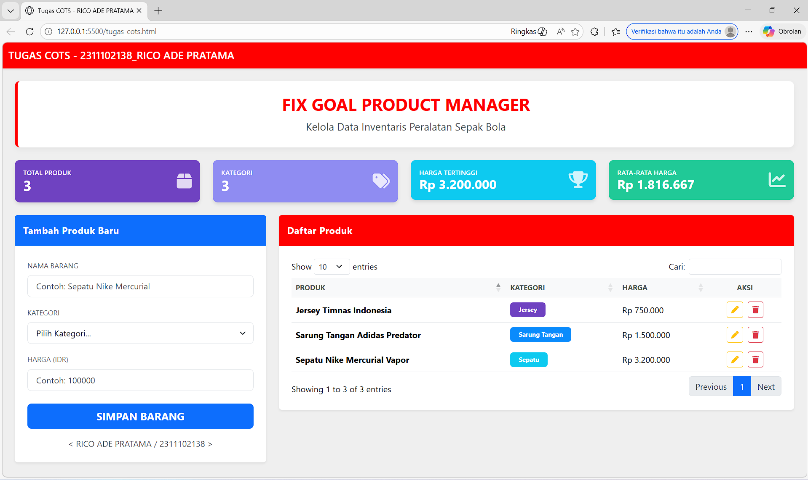
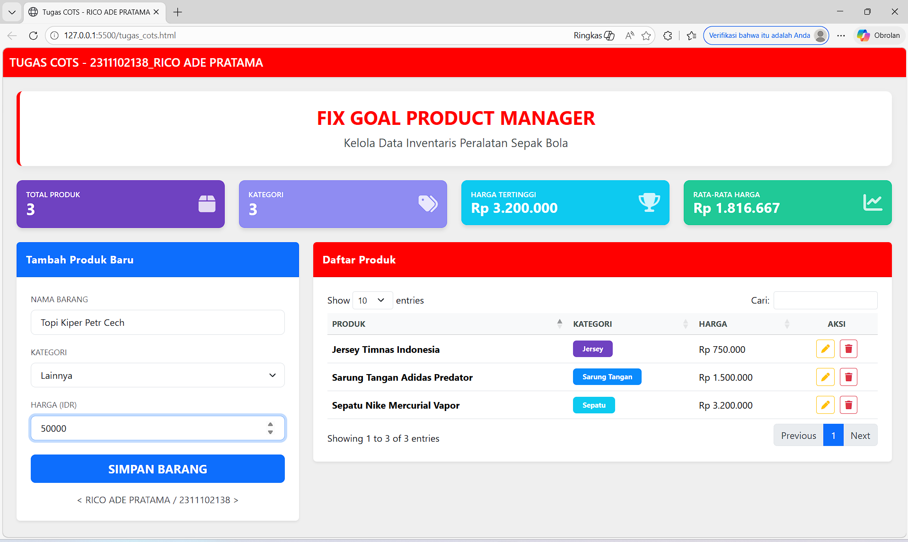
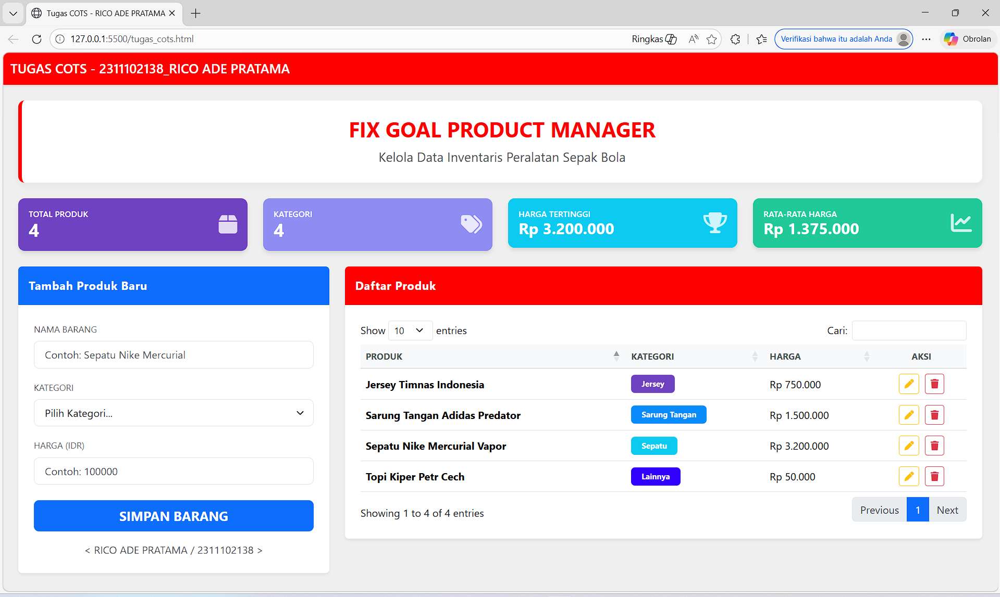
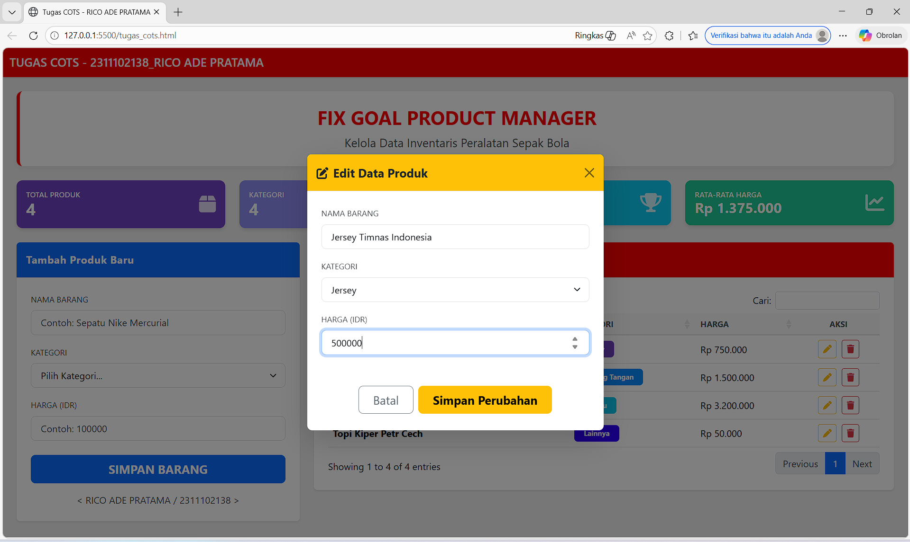
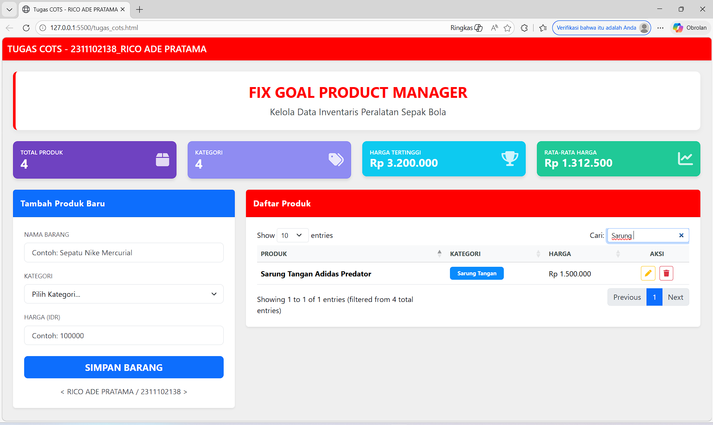
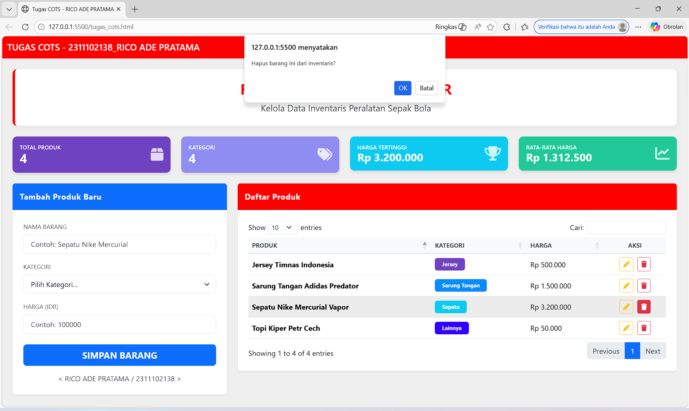
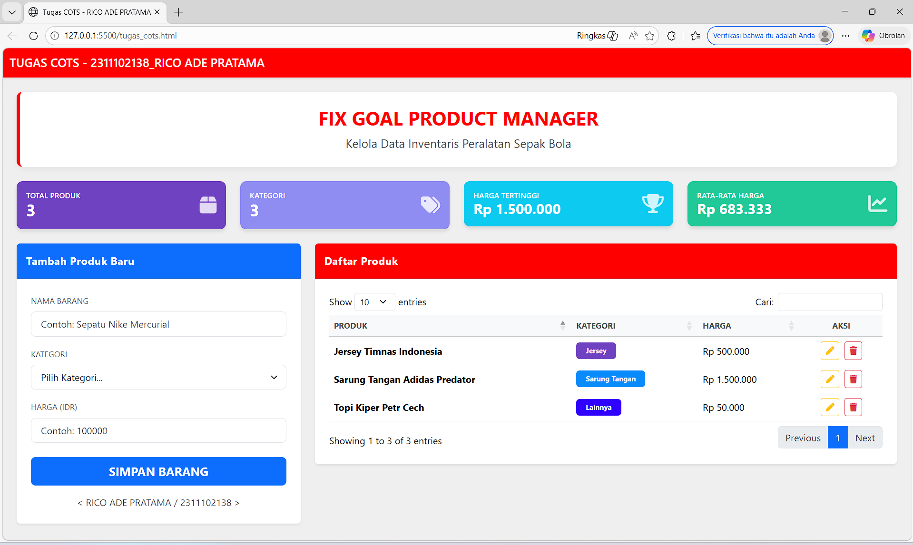

<div align="center">
   <h2>LAPORAN PRAKTIKUM<br>APLIKASI BERBASIS PLATFORM</h2>
   <h>
   <br>
   <h4>TUGAS COTS<br>MANAJEMEN PRODUCT</h4>
   <br>
   
   <br><br>
 
**Disusun Oleh :**<br>
RICO ADE PRATAMA<br>
2311102138<br>
PS1IF-11-REG01
<br><br>
 
**Dosen Pengampu :**<br>
Dimas Fanny Hebrasianto Permadi, S.ST., M.Kom
<br><br>
 
**Assisten Praktikum :**<br>
Apri Pandu Wicaksono
<br>Rangga Pradarrell Fathi
<br><br>
 
PROGRAM STUDI S1 TEKNIK INFORMATIKA<br>
FAKULTAS INFORMATIKA<br>
UNIVERSITAS TELKOM PURWOKERTO<br>
2026

</div>

---

## 1. Dasar Teori

**HTML atau HyperText Markup Language** merupakan bahasa dasar yang digunakan untuk membangun sebuah web dimana HTML menangani elemen-elemen dasar pada pembangunan sebuah website. Langkah-langkah yang dilakukan meliputi pembuatan dokumen HTML dengan struktur dasar, kemudian menambahkan berbagai elemen pada halaman web seperti teks, gambar, serta tautan untuk membangun tampilan dan navigasi halaman.

**Cascading Style Sheets (CSS)** merupakan bahasa yang membantu memperindah tampilan dari laman web yang telah dibangun dengan HTML. CSS mendeskripsikan bagaimana bentuk tampilan elemen HTML seharusnya saat ditampilkan pada laman browser. Selector merupakan elemen HTML yang akan ditambahkan CSS kemudian diikuti dengan declaration block yang terdiri dari property elemen yang akan dirubah beserta value dari property-nya. Setiap deklarasi selector dapat merubah banyak nilai property sekaligus dengan dipisahkan dengan titik koma dan untuk semua declaration block dari satu selector berada di antara kurung kurawal.

**Bootstrap** Bootstrap merupakan sebuah front-end framework gratis untuk pengembangan antar muka web yang lebih cepat dan lebih mudah. Dikembangkan oleh Mark Otto dan Jacom Thornton di Twitter dan dirilis sebagai produk open source pada Agustus 2011 di GitHub. Bootstrap mencakup template desain berbasis HTML dan CSS untuk tipografi, form, button, navigasi, modal, image carousells dan masih banyak lagi, serta terdapat opsional plugin JavaScript. Selain itu, Bootstrap memiliki kemampuan untuk membuat desain responsif yang secara otomatis menyesuaikan diri agar terlihat baik di segala perangkat, mulai dari perangkat ponsel
hingga desktop pc.

**Javascript** merupakan bahasa pemrograman scripting yang digunakan untuk mengubah dokumen HTML statis menjadi dinamis dan interaktif, umumnya digunakan hanya untuk program yang tidak terlalu besar, biasanya hanya beberapa ratus baris, dan mengontrol program yang berbasis Java. Bersamaan dengan perkembangan Internet dan dunia web yang pesat, Javascript akhirnya menjadi bahasa utama dan satu-satunya untuk membuat HTML menjadi interaktif di dalam browser. Beberapa fitur utama yang sering diimplementasikan meliputi penggunaan 'Arrow Function' untuk mempersingkat deklarasi logika, serta 'High-Order Functions' pada array seperti '.map()' untuk ekstraksi data berulang, '.reduce()' untuk akumulasi nilai matematika, dan '.filter()' untuk penyaringan data berdasarkan kondisi tertentu.

**jQuery** merupakan sebuah library (perpustakaan) JavaScript yang cepat, ringkas, dan kaya akan fitur. Contoh implementasinya adalah penggunaan metode '.val()', '.text()', dan pendelegasian event seperti '.on('click')' secara dinamis. DataTables merupakan plugin jQuery yang digunakan untuk meningkatkan fungsionalitas tabel HTML. Plugin ini menyediakan berbagai fitur tambahan seperti: Pencarian data (search), Pagination (pembagian halaman), Sorting (pengurutan data), Responsivitas tabel. Dengan menggunakan DataTables, pengelolaan data dalam tabel menjadi lebih interaktif dan mudah digunakan oleh pengguna.

## 2. Kode Program Unguided

_Tugas COTS_

_Pengumpulan sama seperti pertemuan kemarin di Github di repo COTS Deadline 16 Maret 2026_

Buatlah sebuah halaman web sederhana untuk menampilkan data produk. Pada halaman tersebut terdapat form input dan tabel data produk.

Ketentuan:

1. Gunakan Bootstrap untuk tampilan halaman.
2. Buat form input dengan data:

- Nama Produk
- Kategori
- Harga

6. Data yang diinput dari form harus ditampilkan pada tabel.
7. Gunakan JQuery Datatable pada tabel.
8. Tambahkan tombol hapus pada setiap data di tabel.
9. Pastikan tabel memiliki fitur search dan pagination.
10. Bikin crud sederhana dengan sistem penyimpanan dengan mapping object
    Output:

- Halaman memiliki form input produk
- Data yang dimasukkan muncul di tabel
- Tabel menggunakan Datatable
- Tampilan menggunakan Bootstrap

### Kode HTML (tugas_cots.html)

```html
<!DOCTYPE html>
<html lang="id">
  <head>
    <meta charset="UTF-8" />
    <meta name="viewport" content="width=device-width, initial-scale=1.0" />
    <title>Tugas COTS - RICO ADE PRATAMA</title>
    <link
      href="https://cdn.jsdelivr.net/npm/bootstrap@5.3.2/dist/css/bootstrap.min.css"
      rel="stylesheet"
    />
    <link
      href="https://cdn.datatables.net/1.13.7/css/dataTables.bootstrap5.min.css"
      rel="stylesheet"
    />
    <link
      rel="stylesheet"
      href="https://cdnjs.cloudflare.com/ajax/libs/font-awesome/6.4.2/css/all.min.css"
    />
    <style>
      body {
        background-color: #efefef;
      }
      .navbar-custom {
        background-color: #ff0000;
      }
      /* 2311102138_RICO ADE PRATAMA */
      .bg-card-1 {
        background-color: #6f42c1;
        color: white;
      }
      .bg-card-2 {
        background-color: #8f8cf2;
        color: white;
      }
      .bg-card-3 {
        background-color: #0dcaf0;
        color: white;
      }
      .bg-card-4 {
        background-color: #20c997;
        color: white;
      }
      .summary-icon {
        font-size: 2rem;
        opacity: 0.8;
      }
      .card-summary {
        border-radius: 10px;
        border: none;
        box-shadow: 0 4px 6px rgba(0, 0, 0, 0.1);
      }
      /* Styling untuk Header Card Form & Tabel */
      .card-header-custom {
        font-size: 1.1rem;
        letter-spacing: 0.5px;
        border-radius: 6px 6px 0 0 !important;
      }
      /* Custom Header Background Warna Merah */
      .bg-custom-red {
        background-color: #ff0000 !important;
        color: white !important;
      }
      /* Styling untuk Kotak Judul */
      .title-box {
        background-color: white;
        border-radius: 10px;
        box-shadow: 0 4px 10px rgba(0, 0, 0, 0.05);
        padding: 25px 30px;
        border-left: 6px solid #ff0000;
        width: 100%;
      }
      /* 2311102138_RICO ADE PRATAMA */
      .bg-Jersey {
        background-color: #6f42c1 !important;
        color: white;
      }
      .bg-Rompi {
        background-color: #8f8cf2 !important;
        color: white;
      }
      .bg-Sepatu {
        background-color: #0dcaf0 !important;
        color: white;
      }
      .bg-KaosKaki {
        background-color: #20c997 !important;
        color: white;
      }
      .bg-SarungTangan {
        background-color: #0a8bfc !important;
        color: white;
      }
      .bg-Lainnya {
        background-color: #2f00ff !important;
        color: white;
      }
    </style>
  </head>
  <body>
    <nav class="navbar navbar-dark navbar-custom shadow-sm mb-4">
      <div class="container-fluid">
        <span class="navbar-brand mb-0 h1">
          TUGAS COTS - 2311102138_RICO ADE PRATAMA
        </span>
      </div>
    </nav>
    <div class="container-fluid px-4">
      <div class="row mb-4">
        <div class="col-12">
          <div class="title-box text-center">
            <h2 class="fw-bold mb-2" style="color: #ff0000 !important;">
              FIX GOAL PRODUCT MANAGER
            </h2>
            <p class="text-muted fs-5 mb-0">
              Kelola Data Inventaris Peralatan Sepak Bola
            </p>
          </div>
        </div>
      </div>
      <div class="row mb-4">
        <div class="col-md-3">
          <div class="card card-summary bg-card-1 p-3">
            <div class="d-flex justify-content-between align-items-center">
              <div>
                <h6 class="mb-0 text-uppercase" style="font-size: 0.8rem;">
                  Total Produk
                </h6>
                <h3 class="mb-0 fw-bold" id="sumTotal">0</h3>
              </div>
              <i class="fa-solid fa-box summary-icon"></i>
            </div>
          </div>
        </div>
        <div class="col-md-3">
          <div class="card card-summary bg-card-2 p-3">
            <div class="d-flex justify-content-between align-items-center">
              <div>
                <h6 class="mb-0 text-uppercase" style="font-size: 0.8rem;">
                  Kategori
                </h6>
                <h3 class="mb-0 fw-bold" id="sumKategori">0</h3>
              </div>
              <i class="fa-solid fa-tags summary-icon"></i>
            </div>
          </div>
        </div>
        <div class="col-md-3">
          <div class="card card-summary bg-card-3 p-3">
            <div class="d-flex justify-content-between align-items-center">
              <div>
                <h6 class="mb-0 text-uppercase" style="font-size: 0.8rem;">
                  Harga Tertinggi
                </h6>
                <h3
                  class="mb-0 fw-bold"
                  id="sumTertinggi"
                  style="font-size: 1.5rem;"
                >
                  Rp 0
                </h3>
              </div>
              <i class="fa-solid fa-trophy summary-icon"></i>
            </div>
          </div>
        </div>
        <div class="col-md-3">
          <div class="card card-summary bg-card-4 p-3">
            <div class="d-flex justify-content-between align-items-center">
              <div>
                <h6 class="mb-0 text-uppercase" style="font-size: 0.8rem;">
                  Rata-rata Harga
                </h6>
                <h3
                  class="mb-0 fw-bold"
                  id="sumRata"
                  style="font-size: 1.5rem;"
                >
                  Rp 0
                </h3>
              </div>
              <i class="fa-solid fa-chart-line summary-icon"></i>
            </div>
          </div>
        </div>
      </div>
      <div class="row">
        <div class="col-md-4 mb-4">
          <div class="card shadow-sm border-0 rounded">
            <div
              class="card-header bg-primary text-white fw-bold py-3 card-header-custom"
            >
              Tambah Produk Baru
            </div>
            <div class="card-body p-4">
              <form id="formProduk">
                <div class="mb-3">
                  <label
                    class="form-label text-muted"
                    style="font-size: 0.85rem;"
                    >NAMA BARANG</label
                  >
                  <input
                    type="text"
                    class="form-control form-control-lg fs-6"
                    id="namaProduk"
                    placeholder="Contoh: Sepatu Nike Mercurial"
                    required
                  />
                </div>
                <div class="mb-3">
                  <label
                    class="form-label text-muted"
                    style="font-size: 0.85rem;"
                    >KATEGORI</label
                  >
                  <select
                    class="form-select form-select-lg fs-6"
                    id="kategori"
                    required
                  >
                    <option value="" disabled selected>
                      Pilih Kategori...
                    </option>
                    <option value="Jersey">Jersey</option>
                    <option value="Rompi">Rompi</option>
                    <option value="Sepatu">Sepatu</option>
                    <option value="Kaos Kaki">Kaos Kaki</option>
                    <option value="Sarung Tangan">Sarung Tangan</option>
                    <option value="Lainnya">Lainnya</option>
                  </select>
                </div>
                <div class="mb-4">
                  <label
                    class="form-label text-muted"
                    style="font-size: 0.85rem;"
                    >HARGA (IDR)</label
                  >
                  <input
                    type="number"
                    class="form-control form-control-lg fs-6"
                    id="harga"
                    placeholder="Contoh: 100000"
                    required
                  />
                </div>
                <button
                  type="submit"
                  class="btn btn-primary btn-lg w-100 fw-bold"
                >
                  SIMPAN BARANG
                </button>
                <div class="text-center mt-3 fs-6 text-muted">
                  &lt; RICO ADE PRATAMA / 2311102138 &gt;
                </div>
              </form>
            </div>
          </div>
        </div>
        <div class="col-md-8">
          <div class="card shadow-sm border-0 rounded">
            <div
              class="card-header bg-custom-red fw-bold py-3 card-header-custom"
            >
              Daftar Produk
            </div>
            <div class="card-body p-4">
              <div class="table-responsive">
                <table
                  id="tabelProduk"
                  class="table align-middle table-hover"
                  style="width:100%"
                >
                  <thead class="table-light">
                    <tr>
                      <th class="text-muted" style="font-size: 0.85rem;">
                        PRODUK
                      </th>
                      <th class="text-muted" style="font-size: 0.85rem;">
                        KATEGORI
                      </th>
                      <th class="text-muted" style="font-size: 0.85rem;">
                        HARGA
                      </th>
                      <th
                        class="text-muted text-center"
                        style="font-size: 0.85rem;"
                      >
                        AKSI
                      </th>
                    </tr>
                  </thead>
                  <tbody></tbody>
                </table>
              </div>
            </div>
          </div>
        </div>
      </div>
    </div>
    <div
      class="modal fade"
      id="modalEdit"
      tabindex="-1"
      aria-labelledby="modalEditLabel"
      aria-hidden="true"
    >
      <div class="modal-dialog modal-dialog-centered">
        <div class="modal-content shadow-lg border-0">
          <div class="modal-header bg-warning py-3">
            <h5 class="modal-title fw-bold text-dark" id="modalEditLabel">
              <i class="fa-solid fa-pen-to-square me-2"></i>Edit Data Produk
            </h5>
            <button
              type="button"
              class="btn-close"
              data-bs-dismiss="modal"
              aria-label="Close"
            ></button>
          </div>
          <div class="modal-body p-4">
            <form id="formEditProduk">
              <input type="hidden" id="editId" />
              <div class="mb-3">
                <label class="form-label text-muted" style="font-size: 0.85rem;"
                  >NAMA BARANG</label
                >
                <input
                  type="text"
                  class="form-control form-control-lg fs-6"
                  id="editNama"
                  required
                />
              </div>
              <div class="mb-3">
                <label class="form-label text-muted" style="font-size: 0.85rem;"
                  >KATEGORI</label
                >
                <select
                  class="form-select form-select-lg fs-6"
                  id="editKategori"
                  required
                >
                  <option value="" disabled>Pilih Kategori...</option>
                  <option value="Jersey">Jersey</option>
                  <option value="Rompi">Rompi</option>
                  <option value="Sepatu">Sepatu</option>
                  <option value="Kaos Kaki">Kaos Kaki</option>
                  <option value="Sarung Tangan">Sarung Tangan</option>
                  <option value="Lainnya">Lainnya</option>
                </select>
              </div>
              <div class="mb-4">
                <label class="form-label text-muted" style="font-size: 0.85rem;"
                  >HARGA (IDR)</label
                >
                <input
                  type="number"
                  class="form-control form-control-lg fs-6"
                  id="editHarga"
                  required
                />
              </div>
            </form>
          </div>
          <div class="modal-footer border-0 p-4 pt-0 justify-content-center">
            <button
              type="button"
              class="btn btn-outline-secondary btn-lg px-4"
              data-bs-dismiss="modal"
            >
              Batal
            </button>
            <button
              type="submit"
              form="formEditProduk"
              class="btn btn-warning btn-lg px-4 fw-bold"
            >
              Simpan Perubahan
            </button>
          </div>
        </div>
      </div>
    </div>
    <script src="https://code.jquery.com/jquery-3.7.1.min.js"></script>
    <script src="https://cdn.jsdelivr.net/npm/bootstrap@5.3.2/dist/js/bootstrap.bundle.min.js"></script>
    <script src="https://cdn.datatables.net/1.13.7/js/jquery.dataTables.min.js"></script>
    <script src="https://cdn.datatables.net/1.13.7/js/dataTables.bootstrap5.min.js"></script>
    <script>
      $(document).ready(function () {
        let dataProduk = [
          {
            id: 1,
            nama: "Sepatu Nike Mercurial Vapor",
            kategori: "Sepatu",
            harga: 3200000,
          },
          {
            id: 2,
            nama: "Jersey Timnas Indonesia",
            kategori: "Jersey",
            harga: 750000,
          },
          {
            id: 3,
            nama: "Sarung Tangan Adidas Predator",
            kategori: "Sarung Tangan",
            harga: 1500000,
          },
        ];
        const formatRupiah = (angka) => {
          return "Rp " + parseInt(angka).toLocaleString("id-ID");
        };
        const updateSummary = () => {
          let totalProduk = dataProduk.length;
          let kategoriUnik = new Set(dataProduk.map((item) => item.kategori))
            .size;
          let hargaTertinggi = 0;
          let totalHarga = 0;
          if (totalProduk > 0) {
            let hargaArray = dataProduk.map((item) => parseInt(item.harga));
            hargaTertinggi = Math.max(...hargaArray);
            totalHarga = hargaArray.reduce((a, b) => a + b, 0);
          }
          let rataRata =
            totalProduk > 0 ? Math.round(totalHarga / totalProduk) : 0;
          $("#sumTotal").text(totalProduk);
          $("#sumKategori").text(kategoriUnik);
          $("#sumTertinggi").text(formatRupiah(hargaTertinggi));
          $("#sumRata").text(formatRupiah(rataRata));
        };
        const renderBadge = (kategori) => {
          let classKategori = kategori.replace(/\s+/g, "");
          return `<span class="badge bg-${classKategori} px-3 py-2 text-capitalize">${kategori}</span>`;
        };
        let tabel = $("#tabelProduk").DataTable({
          data: dataProduk,
          columns: [
            {
              data: "nama",
              className: "fw-bold",
            },
            {
              data: "kategori",
              render: function (data) {
                return renderBadge(data);
              },
            },
            {
              data: "harga",
              render: function (data) {
                return formatRupiah(data);
              },
            },
            {
              data: "id",
              className: "text-center",
              orderable: false,
              searchable: false,
              render: function (data) {
                return `
                            <button class="btn btn-outline-warning btn-sm me-1 btn-edit" data-id="${data}" title="Edit Data"><i class="fa-solid fa-pen"></i></button>
                            <button class="btn btn-outline-danger btn-sm btn-hapus" data-id="${data}" title="Hapus"><i class="fa-solid fa-trash"></i></button>
                        `;
              },
            },
          ],
          language: { search: "Cari:", lengthMenu: "Show _MENU_ entries" },
        });
        updateSummary();
        // Submit Tambah Data 2311102138_RICO ADE PRATAMA
        $("#formProduk").submit(function (e) {
          e.preventDefault();
          let produkBaru = {
            id: Date.now(),
            nama: $("#namaProduk").val(),
            kategori: $("#kategori").val(),
            harga: parseInt($("#harga").val()),
          };
          dataProduk.push(produkBaru);
          tabel.row.add(produkBaru).draw();
          updateSummary();
          $("#formProduk")[0].reset();
        });
        // Edit Data
        $("#tabelProduk tbody").on("click", ".btn-edit", function () {
          let idEdit = $(this).data("id");
          let produk = dataProduk.find((item) => item.id == idEdit);
          if (produk) {
            $("#editId").val(produk.id);
            $("#editNama").val(produk.nama);
            $("#editKategori").val(produk.kategori);
            $("#editHarga").val(produk.harga);
            $("#modalEdit").modal("show");
          }
        });
        $("#formEditProduk").submit(function (e) {
          e.preventDefault();
          let idEdit = $("#editId").val();
          let produkIndex = dataProduk.findIndex((item) => item.id == idEdit);
          if (produkIndex !== -1) {
            dataProduk[produkIndex].nama = $("#editNama").val();
            dataProduk[produkIndex].kategori = $("#editKategori").val();
            dataProduk[produkIndex].harga = parseInt($("#editHarga").val());
            let rowData = dataProduk[produkIndex];
            tabel
              .row(function (idx, data, node) {
                return data.id == idEdit;
              })
              .data(rowData)
              .draw();
            updateSummary();
            $("#modalEdit").modal("hide");
          }
        });
        // Hapus Data
        $("#tabelProduk tbody").on("click", ".btn-hapus", function () {
          let idHapus = $(this).data("id");
          let baris = $(this).parents("tr");
          if (confirm("Hapus barang ini dari inventaris?")) {
            dataProduk = dataProduk.filter((produk) => produk.id !== idHapus);
            tabel.row(baris).remove().draw();
            updateSummary();
          }
        });
      });
    </script>
  </body>
</html>
```

### Hasil Output + Langkah Penjelasan

1. Tampilan utama Halaman.



2. Fitur Menambahkan Produk:

- Nama Barang: Topi Petr Cech
- Ketegori: Lainnya
- Harga: 50000
- Simpan Barang



3. Berhasil menambahkan Produk, Daftar Produk berubah. Serta "Total Produk", "Kategori", "Harga Tertinggi", "Rata-Rata Harga" juga ikut Berubah.



4. Fitur Edit Barang, dengan mengklik icon kuas kuning diaksi.
   Awal Data Produk Misal:

- Nama Barang: Jersey Timnas Indonesia
- Kategori: Jersey
- Harga: 750000
  Edit Data Produk Misal:
- Nama Barang: Jersey Timnas Indonesia
- Kategori: Jersey
- Harga: 500000
- Simpan Perubahan



5. Perubahan Berhasil Disimpan, Daftar Produk berubah bagian harga "Jersey Timnas Indonesia".


6. Fitur Search / Pencarian Barang, dengan mengklik teks "Cari" dan mengetik Barang yang dicari, misal cukup mengetik "Sarung" hasil akan menemukan bahwa ada 1 barang yang berama "Sarung Tangan Adidas Predator".



7. Fitur Delete / Hapus Barang, dengan mengklik icon sampah merah diaksi. Misal karena harga terlalu tinggi kita menghapus barang "Sepatu Nike Mercurial Vapor". Lalu akan muncul pop up "Hapus barang ini dari inventaris?" lalu ketik "ok" agar Barang benar-benar kehapus.



8. Berhasil menghapus Produk, Daftar Produk berubah. Serta "Total Produk", "Kategori", "Harga Tertinggi", "Rata-Rata Harga" juga ikut Berubah.



### Penjelasan Kode HTML

Kode HTML yang saya bikin ini merupakan halaman web yang dibangun menggunakan struktur dasar HTML5 dengan tag 'meta' untuk memastikan 'viewport' yang responsif. Tampilan antarmuka dikembangkan menggunakan sistem grid Bootstrap 5 ('col-md-3', 'col-md-4', 'col-md-8') yang diimpor via tag 'link', digabungkan dengan ikon dari FontAwesome dan kerangka tabel dari DataTables. Pada bagian 'style', terdapat CSS kustom untuk memberikan pewarnaan spesifik, seperti class '.bg-custom-red' pada navbar serta penamaan class dinamis untuk badge kategori (misalnya '.bg-Jersey'). Secara tata letak, halaman ini menampung empat kartu statistik, sebuah formulir input dengan id 'formProduk', tabel utama id 'tabelProduk' dengan bagian 'tbody' yang dikosongkan, serta komponen pop-up tersembunyi berupa id 'modalEdit' untuk keperluan pembaruan data.

Logika utama aplikasi berjalan di dalam JavaScript, menggunakan array of objects bernama 'dataProduk' sebagai database lokal sementara yang memuat tiga data awal. Untuk memformat data sebelum ditampilkan, terdapat fungsi 'formatRupiah()' yang memanfaatkan metode 'toLocaleString('id-ID')' untuk memberikan pemisah ribuan, serta fungsi 'renderBadge()' yang menggunakan regex 'replace(/\s+/g, '')' untuk menghilangkan spasi pada nama kategori agar sinkron dengan nama class CSS. Fungsi analitik 'updateSummary()' bertugas menghitung statistik secara dinamis menggunakan berbagai metode bawaan: 'map()' untuk mengekstrak kolom, 'Set().size' untuk mencari jumlah kategori unik, 'Math.max()' untuk menentukan harga tertinggi, dan 'reduce()' untuk mengakumulasi total harga. Hasil perhitungan tersebut kemudian disuntikkan secara seketika ke elemen HTML kartu statistik menggunakan metode 'text()'.

Proses manipulasi data (CRUD) diimplementasikan sepenuhnya dengan jQuery dan DataTables. Saat inisialisasi, fungsi 'DataTable()' mengubah tabel standar menjadi tabel interaktif, di mana properti 'columns' memetakan isi array, memformatnya dengan opsi 'render', dan mencetak tombol aksi yang dibekali atribut 'data-id'. Pada proses tambah data (Create), event 'submit()' dicegat menggunakan 'preventDefault()', lalu objek data baru dimasukkan ke array dengan 'push()' dan ditambahkan ke tabel menggunakan 'row.add().draw()'. Untuk proses ubah data (Update), event listener 'on('click')' mencari data spesifik dengan 'find()', menampilkannya di form via 'modal('show')', dan saat disimpan, sistem mencari indeks lewat 'findIndex()' lalu menimpa baris tabel menggunakan 'row().data().draw()'. Terakhir, untuk hapus data (Delete), konfirmasi 'confirm()' memicu metode 'filter()' untuk membuang data dari array, sementara 'row().remove().draw()' menghapus baris visualnya dari tabel. Setiap aksi CRUD selalu diakhiri dengan pemanggilan 'updateSummary()' agar angka ringkasan tetap sinkron. Lebih jelasnya seperti pada gambar output dan penjelasan di atas.

## 3. Kesimpulan dan Penutup

Tugas cots ini menjelaskan konsep implementasi antarmuka web interaktif untuk sistem manajemen inventaris peralatan sepak bola, dengan fokus pada penggabungan Bootstrap 5, jQuery, dan DataTables guna mengeksekusi operasi CRUD (Create, Read, Update, Delete) secara dinamis tanpa memuat ulang halaman. Cocok digunakan sebagai pembelajaran praktikum bagi mahasiswa program studi Informatika di Telkom University Purwokerto untuk membangun situs web modern.

<br>Ngabuburit di daerah Baturraden,
<br>Sama kawan-kawan dengan motoran.
<br>Tugas COTS Rico sudah absen,
<br>Siap di-push ke GitHub sebagai laporan.

## 4. Referensi

- [1] [Materi Modul 2](https://drive.google.com/file/d/1f-WJU1OaMIyZZZXtIissubHZ9fdcUO8y/view)

- [2] [Materi Modul 3](https://drive.google.com/file/d/1YZ4-EXXFpIfaoV6P8ZpeixciZLjrFiy5/view)

- [3] [Materi Modul 4](https://drive.google.com/file/d/1Qxsa7wNn3PNrDLYzgBKb62GZi4mPkoub/view)

- [4] [Materi Modul 5](https://drive.google.com/file/d/1NKK3wu2ww23vudPo1DypbbiI9NM_9zwG/view)
