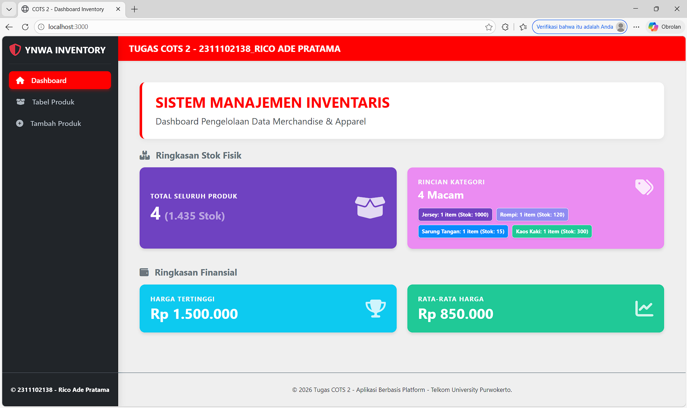
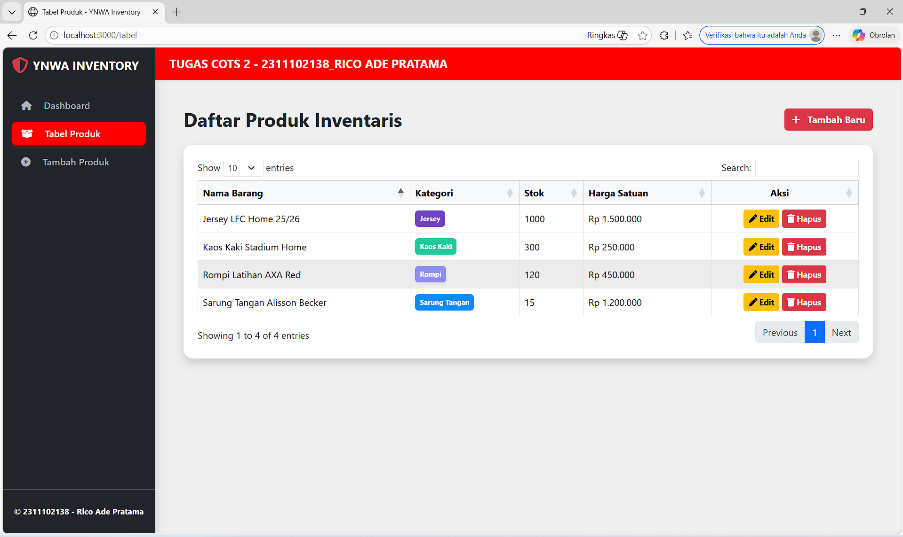
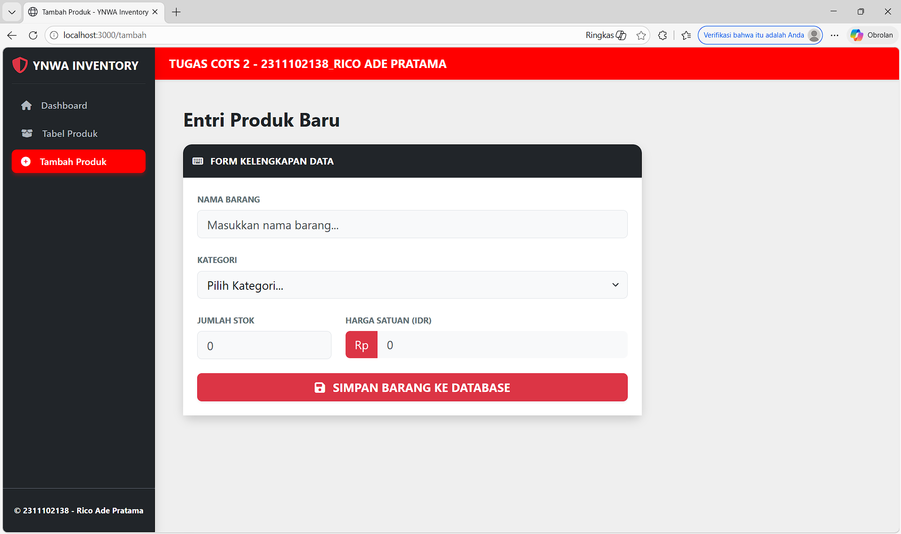
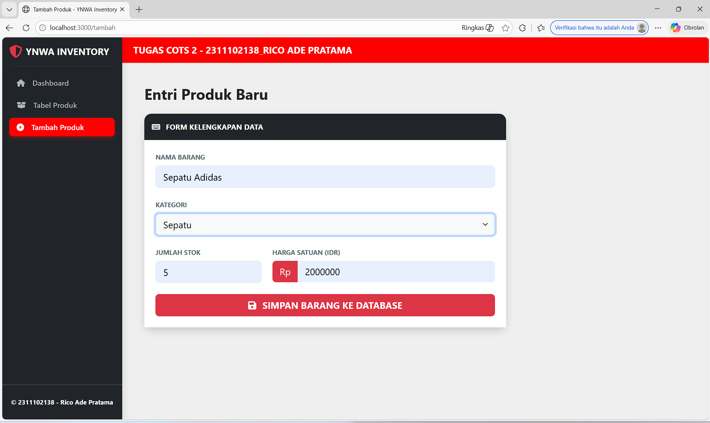
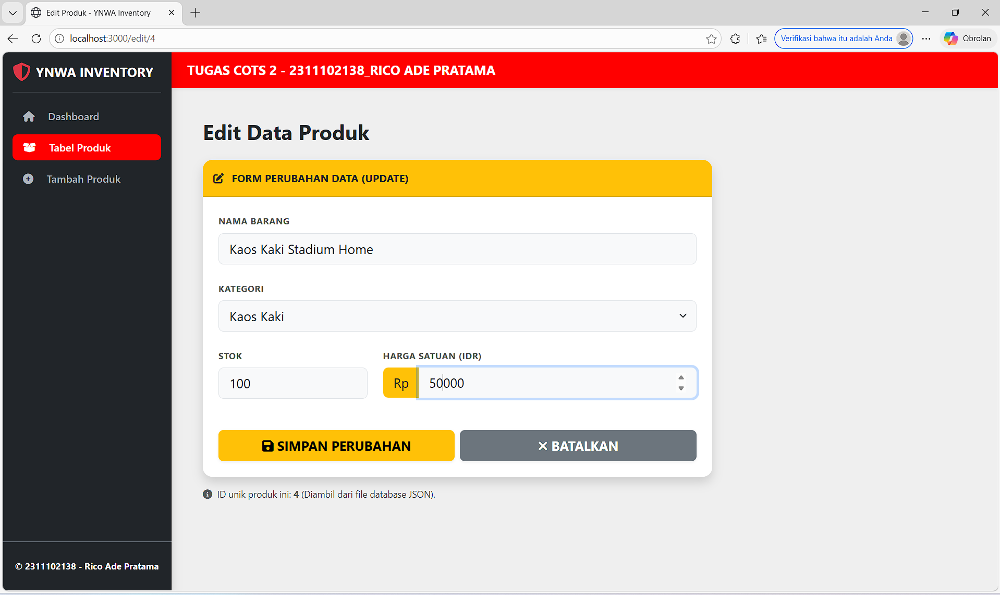
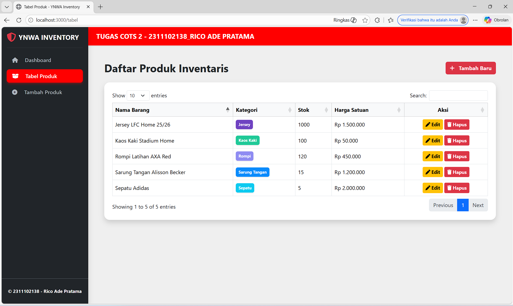
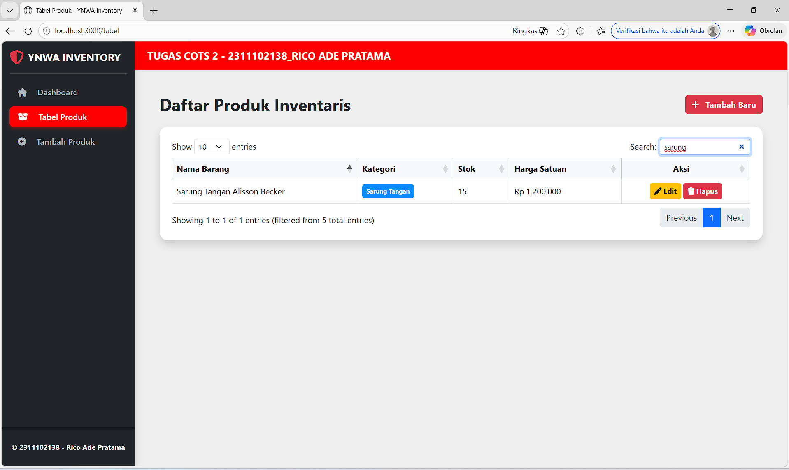
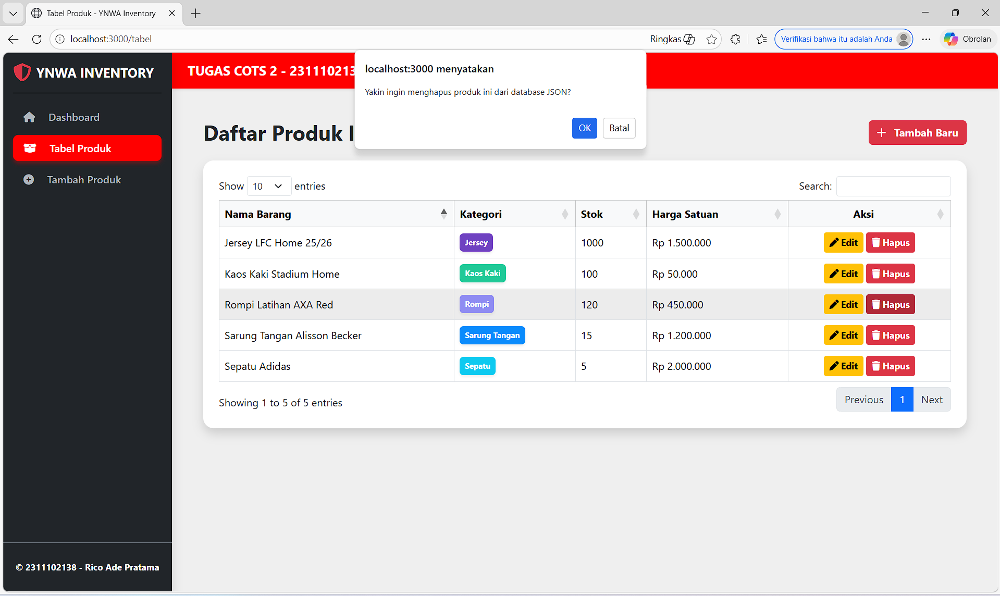
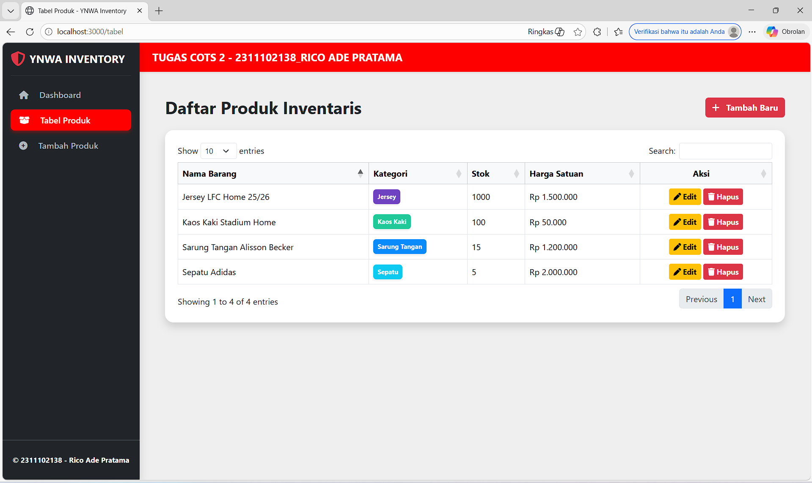
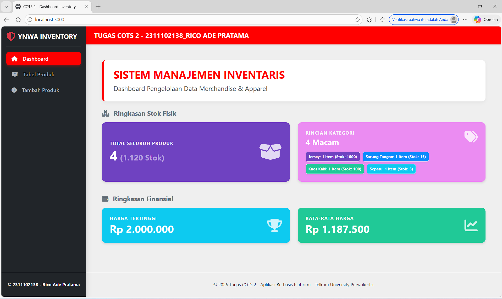

<div align="center">
   <h2>LAPORAN PRAKTIKUM<br>APLIKASI BERBASIS PLATFORM</h2>
   <h>
   <br>
   <h4>TUGAS COTS 2<br>MANAJEMEN PRODUCT - YNWA INVENTORY</h4>
   <br>
   
   <br><br>
 
**Disusun Oleh :**<br>
RICO ADE PRATAMA<br>
2311102138<br>
PS1IF-11-REG01
<br><br>
 
**Dosen Pengampu :**<br>
Dimas Fanny Hebrasianto Permadi, S.ST., M.Kom
<br><br>
 
**Assisten Praktikum :**<br>
Apri Pandu Wicaksono
<br>Rangga Pradarrell Fathi
<br><br>
 
PROGRAM STUDI S1 TEKNIK INFORMATIKA<br>
FAKULTAS INFORMATIKA<br>
UNIVERSITAS TELKOM PURWOKERTO<br>
2026

</div>

---

## 1. Dasar Teori

**HTML atau HyperText Markup Language** merupakan bahasa dasar yang digunakan untuk membangun sebuah web dimana HTML menangani elemen-elemen dasar pada pembangunan sebuah website. Langkah-langkah yang dilakukan meliputi pembuatan dokumen HTML dengan struktur dasar, kemudian menambahkan berbagai elemen pada halaman web seperti teks, gambar, serta tautan untuk membangun tampilan dan navigasi halaman.

**Cascading Style Sheets (CSS)** merupakan bahasa yang membantu memperindah tampilan dari laman web yang telah dibangun dengan HTML. CSS mendeskripsikan bagaimana bentuk tampilan elemen HTML seharusnya saat ditampilkan pada laman browser. Selector merupakan elemen HTML yang akan ditambahkan CSS kemudian diikuti dengan declaration block yang terdiri dari property elemen yang akan dirubah beserta value dari property-nya. Setiap deklarasi selector dapat merubah banyak nilai property sekaligus dengan dipisahkan dengan titik koma dan untuk semua declaration block dari satu selector berada di antara kurung kurawal.

**Bootstrap** Bootstrap merupakan sebuah front-end framework gratis untuk pengembangan antar muka web yang lebih cepat dan lebih mudah. Dikembangkan oleh Mark Otto dan Jacom Thornton di Twitter dan dirilis sebagai produk open source pada Agustus 2011 di GitHub. Bootstrap mencakup template desain berbasis HTML dan CSS untuk tipografi, form, button, navigasi, modal, image carousells dan masih banyak lagi, serta terdapat opsional plugin JavaScript. Selain itu, Bootstrap memiliki kemampuan untuk membuat desain responsif yang secara otomatis menyesuaikan diri agar terlihat baik di segala perangkat, mulai dari perangkat ponsel
hingga desktop pc.

**JavaScript dan AJAX**
JavaScript merupakan bahasa pemrograman tingkat tinggi yang memungkinkan halaman web statis menjadi dinamis dan interaktif. JavaScript beroperasi di sisi klien (client-side) untuk memanipulasi Document Object Model (DOM) secara real-time.
Dalam komunikasi data, JavaScript memanfaatkan teknologi AJAX (Asynchronous JavaScript and XML). AJAX memungkinkan aplikasi web untuk mengirim dan menerima data dari server di latar belakang secara asinkron. Hal ini berarti antarmuka aplikasi dapat diperbarui sebagian (seperti menambah atau menghapus data di tabel) tanpa perlu memuat ulang (reload) keseluruhan halaman web.

**jQuery dan DataTables**
jQuery merupakan pustaka (library) JavaScript yang ringkas dan kaya fitur. Pustaka ini menyederhanakan tugas-tugas kompleks dalam JavaScript seperti penelusuran dokumen HTML, penanganan event (contoh: klik tombol via .on('click')), animasi, dan pemanggilan AJAX (seperti $.get dan $.ajax).
DataTables adalah plugin ekstensif dari jQuery yang secara khusus digunakan untuk meningkatkan fungsionalitas tabel HTML standar. Pustaka ini secara instan menambahkan fitur interaktif kelas enterprise pada tabel, meliputi pencarian data (search), pembagian halaman (pagination), serta pengurutan data (sorting).

**JSON (JavaScript Object Notation)**
JSON adalah format pertukaran data teks ringan yang mudah dibaca dan ditulis oleh manusia, serta mudah diurai (parse) dan dibuat (generate) oleh mesin. Dalam arsitektur aplikasi web modern, JSON menjadi standar utama untuk mengirimkan data dari server (Backend API) menuju klien (Frontend). Pada implementasi DataTables, format data JSON digunakan sebagai sumber pustaka data dinamis yang secara otomatis akan di-render ke dalam baris dan kolom tabel.

**NodeJS dan Konsep CRUD**
NodeJS merupakan runtime environment berbasis JavaScript yang mengeksekusi kode di sisi server (backend). Berbeda dengan eksekusi di browser, NodeJS memungkinkan JavaScript digunakan untuk mengelola routing, memproses request HTTP, serta berinteraksi dengan basis data (database). Dalam ekosistem aplikasi ini, NodeJS bertindak sebagai penyedia Application Programming Interface (API) untuk melayani operasi CRUD, yang merupakan empat fungsi dasar dalam manajemen penyimpanan persisten:

Create (Membuat/menambah data baru via metode POST).

Read (Membaca/menampilkan data via metode GET).

Update (Memperbarui/mengedit data yang sudah ada via metode PUT).

Delete (Menghapus data via metode DELETE).

## 2. Kode Program Unguided

_Tugas COTS 2_

Buatlah sebuah aplikasi web sederhana yang memiliki minimal 3 (tiga) halaman fungsional yang mencakup Form, Halaman Data (Tabel), dan fungsionalitas CRUD (Create, Read, Update, Delete).

A. Spesifikasi Teknis Pengembangan (Wajib):

1. Aplikasi harus menggunakan Framework Bootstrap sebagai styling.
2. Aplikasi harus dibangun menggunakan Framework CodeIgniter (CI) atau NodeJS (express, fastify, atau berbasis library lain nya).
3. Struktur Halaman: Minimal terdiri dari 3 halaman utama:
   - Halaman Form (Input Data)
   - Halaman Tabel / Tampil Data
   - Fungsionalitas CRUD yang berjalan dengan baik.

4. Wajib menggunakan jQuery dan jQuery plugin.

5. Data yang ditampilkan pada tabel wajib menggunakan format data JSON, yang diimplementasikan menggunakan datatable Jquery.

### Struktur Program

```
YNWA-Inventory/
├── node_modules/           ← Library/Dependencies Node.js (Express, EJS, dll)
├── views/                  ← Folder Template Engine (Tampilan Antarmuka)
│   ├── edit.ejs            ← Halaman Form Perubahan Data (Update)
│   ├── from.ejs            ← Halaman Form Entri Data Baru (Create)
│   ├── index.ejs           ← Halaman Dashboard Statistik Utama
│   └── tabel.ejs           ← Halaman Daftar Produk (DataTable + Action)
├── app.js                  ← Server Utama (Konfigurasi Express, Routes, & API)
├── data.json               ← Database Lokal (Penyimpanan data format JSON)
├── package-lock.json       ← Catatan versi detail dependencies
└── package.json            ← Konfigurasi Proyek & Daftar Library yang digunakan
```

### Kode app.js

```js
/* 2311102138_Rico Ade Pratama */

// [POIN A.2]: Menggunakan Framework NodeJS dengan library Express
const express = require("express");
const fs = require("fs");
const path = require("path");
const app = express();
const port = 3000;

// [POIN A.3]: Konfigurasi EJS sebagai Template Engine untuk merender halaman
app.set("view engine", "ejs");
app.set("views", path.join(__dirname, "views"));

app.use(express.urlencoded({ extended: true }));
app.use(express.json());

// [POIN A.5]: Path/Jalur utama menuju database file berformat JSON
const dataPath = path.join(__dirname, "data.json");

/* Helper untuk membaca data dari file JSON */
const readData = () => {
  try {
    const rawData = fs.readFileSync(dataPath, "utf-8");
    return JSON.parse(rawData);
  } catch (err) {
    return [];
  }
};

/* Helper untuk menyimpan data kembali ke file JSON Menggunakan format JSON.stringify */
const writeData = (data) => {
  fs.writeFileSync(dataPath, JSON.stringify(data, null, 2), "utf-8");
};

// [POIN A.3]: ROUTING HALAMAN UTAMA
app.get("/", (req, res) => {
  res.render("index");
});

app.get("/tabel", (req, res) => {
  res.render("tabel");
});

app.get("/tambah", (req, res) => {
  res.render("from");
});

app.get("/edit/:id", (req, res) => {
  const items = readData();
  const item = items.find((i) => i.id == req.params.id);
  if (!item) return res.status(404).send("Data tidak ditemukan");
  res.render("edit", { item: item });
});

// [POIN A.5]: API & FUNGSIONALITAS CRUD

/* [READ]: Endpoint API menyediakan data format JSON dikonsumsi oleh JQuery. */
app.get("/api/produk", (req, res) => {
  res.json({ data: readData() });
});

/* [CREATE]: Proses menambahkan produk baru ke dalam database JSON. */
app.post("/tambah", (req, res) => {
  const items = readData();
  const newItem = {
    id: Date.now(),
    nama: req.body.nama,
    kategori: req.body.kategori,
    stok: Number(req.body.stok) || 0,
    harga: Number(req.body.harga) || 0,
  };
  items.push(newItem);
  writeData(items);
  res.redirect("/tabel");
});

/* [UPDATE]: Proses memperbarui data produk. */
app.post("/edit/:id", (req, res) => {
  let items = readData();
  const index = items.findIndex((i) => i.id == req.params.id);
  if (index !== -1) {
    items[index].nama = req.body.nama;
    items[index].kategori = req.body.kategori;
    items[index].stok = Number(req.body.stok) || 0;
    items[index].harga = Number(req.body.harga) || 0;
    writeData(items);
  }
  res.redirect("/tabel");
});

/* [DELETE]: Proses menghapus data, dipanggil menggunakan metode AJAX DELETE dari JQuery (Poin A.4). */
app.delete("/hapus/:id", (req, res) => {
  let items = readData();
  items = items.filter((i) => i.id != req.params.id);
  writeData(items);
  res.json({ success: true, message: "Data berhasil dihapus dari JSON" });
});

// START SERVER
app.listen(port, () => {
  console.log(`Server jalan di http://localhost:${port}`);
  console.log(`Log: Database JSON siap digunakan.`);
});
```

### Penjelasan Kode app.js

Program ini merupakan sebuah Sistem Informasi Manajemen Inventaris Merchandise berbasis web yang dibangun menggunakan Node.js dengan framework Express.js. Aplikasi ini dirancang untuk mengelola data barang secara dinamis dengan mengimplementasikan fungsionalitas CRUD (Create, Read, Update, Delete) yang terintegrasi langsung dengan file sistem berformat JSON sebagai pusat penyimpanan datanya. Dari sisi antarmuka, program ini memanfaatkan framework Bootstrap 5 untuk menjamin tampilan yang responsif dan profesional, serta didukung oleh library jQuery dan plugin DataTables untuk menyajikan data tabel yang interaktif, lengkap dengan fitur pencarian, sortir, dan pembaruan data secara real-time melalui teknik AJAX.

### Kode index.ejs (Folder views)

```html
<!DOCTYPE html>
<html lang="id">
  <head>
    <meta charset="UTF-8" />
    <title>COTS 2 - Dashboard Inventory</title>

    <link
      href="https://cdn.jsdelivr.net/npm/bootstrap@5.3.2/dist/css/bootstrap.min.css"
      rel="stylesheet"
    />
    <link
      rel="stylesheet"
      href="https://cdnjs.cloudflare.com/ajax/libs/font-awesome/6.4.2/css/all.min.css"
    />

    <style>
      /* [CSS CUSTOM]: Pengaturan dasar layouting dan sidebar aplikasi */
      body {
        background-color: #efefef;
        overflow: hidden;
        height: 100vh;
        margin: 0;
      }

      /* Sidebar Menu Samping */
      .sidebar {
        width: 260px;
        background-color: #212529;
        height: 100vh;
        z-index: 100;
      }

      .sidebar .nav-link {
        color: #adb5bd;
        border-radius: 8px;
        margin-bottom: 8px;
        font-weight: 500;
        transition: 0.3s;
      }

      .sidebar .nav-link:hover {
        background-color: #343a40;
        color: white;
      }

      .sidebar .nav-link.active {
        background-color: #ff0000;
        color: white;
        box-shadow: 0 4px 6px rgba(255, 0, 0, 0.3);
      }

      /* Area Konten Utama */
      .main-content {
        flex-grow: 1;
        height: 100vh;
        display: flex;
        flex-direction: column;
        overflow: hidden;
        background-color: #efefef;
      }

      .content-scrollable {
        flex-grow: 1;
        overflow-y: auto;
        padding-bottom: 30px;
      }

      /* Pewarnaan Kartu Statistik Dashboard (Bootstrap Card Customization) */
      .bg-card-1 {
        background-color: #6f42c1;
        color: white;
      }

      .bg-card-2 {
        background-color: #eb8cf2;
        color: white;
      }

      .bg-card-3 {
        background-color: #0dcaf0;
        color: white;
      }

      .bg-card-4 {
        background-color: #20c997;
        color: white;
      }

      /* Efek Visual Hover pada Kartu Ringkasan */
      .summary-icon {
        font-size: 2.5rem;
        opacity: 0.8;
      }

      .card-summary {
        border-radius: 12px;
        border: none;
        box-shadow: 0 4px 6px rgba(0, 0, 0, 0.1);
        transition: transform 0.2s;
      }

      .card-summary:hover {
        transform: translateY(-5px);
      }

      /* Box Judul Halaman */
      .title-box {
        background-color: white;
        border-radius: 12px;
        box-shadow: 0 4px 10px rgba(0, 0, 0, 0.05);
        padding: 25px 30px;
        border-left: 6px solid #ff0000;
        width: 100%;
      }

      /* [STYLE DINAMIS]: Pengaturan warna badge berdasarkan kategori yang ada di database */
      .bg-Jersey {
        background-color: #6f42c1 !important;
      }

      .bg-Rompi {
        background-color: #8f8cf2 !important;
      }

      .bg-Sepatu {
        background-color: #0dcaf0 !important;
      }

      .bg-KaosKaki {
        background-color: #20c997 !important;
      }

      .bg-SarungTangan {
        background-color: #0a8bfc !important;
      }

      .bg-Lainnya {
        background-color: #2f00ff !important;
      }
    </style>
  </head>

  <body class="d-flex">
    <div class="sidebar d-flex flex-column flex-shrink-0 text-white shadow">
      <div class="p-3 flex-grow-1">
        <a
          href="/"
          class="d-flex align-items-center mb-3 text-white text-decoration-none"
        >
          <i class="fa-solid fa-shield-halved fs-3 me-2 text-danger"></i>
          <span class="fs-5 fw-bold letter-spacing-1">YNWA INVENTORY</span>
        </a>
        <hr class="border-secondary" />
        <ul class="nav nav-pills flex-column mb-auto mt-2">
          <li class="nav-item">
            <a href="/" class="nav-link active"
              ><i class="fa-solid fa-house me-3 w-20px text-center"></i
              >Dashboard</a
            >
          </li>
          <li>
            <a href="/tabel" class="nav-link"
              ><i class="fa-solid fa-box-open me-3 w-20px text-center"></i>Tabel
              Produk</a
            >
          </li>
          <li>
            <a href="/tambah" class="nav-link"
              ><i class="fa-solid fa-circle-plus me-3 w-20px text-center"></i
              >Tambah Produk</a
            >
          </li>
        </ul>
      </div>
      <div
        class="border-top border-secondary d-flex align-items-center justify-content-center"
        style="height: 75px"
      >
        <div class="text-white fw-bold" style="font-size: 0.85rem">
          &copy; 2311102138 - Rico Ade Pratama
        </div>
      </div>
    </div>

    <div class="main-content w-100">
      <div
        class="text-white px-4 py-3 shadow-sm w-100"
        style="background-color: #ff0000; z-index: 10"
      >
        <h5 class="mb-0 fw-bold">TUGAS COTS 2 - 2311102138_RICO ADE PRATAMA</h5>
      </div>

      <div class="content-scrollable p-4 p-md-5 pt-4">
        <div class="row mb-4">
          <div class="col-12">
            <div class="title-box">
              <h2 class="fw-bold mb-2" style="color: #ff0000 !important">
                SISTEM MANAJEMEN INVENTARIS
              </h2>
              <p class="text-muted fs-5 mb-0">
                Dashboard Pengelolaan Data Merchandise & Apparel
              </p>
            </div>
          </div>
        </div>

        <h5 class="fw-bold text-secondary mb-3">
          <i class="fa-solid fa-boxes-stacked me-2"></i> Ringkasan Stok Fisik
        </h5>
        <div class="row mb-4">
          <div class="col-md-6 mb-3">
            <div
              class="card card-summary bg-card-1 p-4 h-100 d-flex justify-content-center"
            >
              <div class="d-flex justify-content-between align-items-center">
                <div>
                  <h6
                    class="mb-1 text-uppercase fw-bold text-light"
                    style="font-size: 0.9rem; letter-spacing: 1px"
                  >
                    Total Seluruh Produk
                  </h6>
                  <div class="d-flex align-items-baseline">
                    <h1 class="mb-0 fw-bold" id="sumTotal">0</h1>
                    <span
                      class="ms-2 fw-bold fs-4 text-white-50"
                      id="sumStokFisik"
                      >()</span
                    >
                  </div>
                </div>
                <i
                  class="fa-solid fa-box-open summary-icon"
                  style="font-size: 3.5rem"
                ></i>
              </div>
            </div>
          </div>
          <div class="col-md-6 mb-3">
            <div class="card card-summary bg-card-2 p-4 h-100">
              <div
                class="d-flex justify-content-between align-items-start mb-3"
              >
                <div>
                  <h6
                    class="mb-1 text-uppercase fw-bold text-light"
                    style="font-size: 0.9rem; letter-spacing: 1px"
                  >
                    Rincian Kategori
                  </h6>
                  <h4 class="mb-0 fw-bold" id="sumKategori">0 Kategori</h4>
                </div>
                <i
                  class="fa-solid fa-tags summary-icon"
                  style="font-size: 2.5rem"
                ></i>
              </div>
              <div
                id="kategoriList"
                class="d-flex flex-wrap gap-2 mt-auto"
              ></div>
            </div>
          </div>
        </div>

        <h5 class="fw-bold text-secondary mb-3">
          <i class="fa-solid fa-wallet me-2"></i> Ringkasan Finansial
        </h5>
        <div class="row mb-2">
          <div class="col-md-6 mb-3">
            <div class="card card-summary bg-card-3 p-4 h-100">
              <div class="d-flex justify-content-between align-items-center">
                <div>
                  <h6
                    class="mb-1 text-uppercase fw-bold text-light"
                    style="font-size: 0.9rem; letter-spacing: 1px"
                  >
                    Harga Tertinggi
                  </h6>
                  <h2 class="mb-0 fw-bold" id="sumTertinggi">Rp 0</h2>
                </div>
                <i class="fa-solid fa-trophy summary-icon"></i>
              </div>
            </div>
          </div>
          <div class="col-md-6 mb-3">
            <div class="card card-summary bg-card-4 p-4 h-100">
              <div class="d-flex justify-content-between align-items-center">
                <div>
                  <h6
                    class="mb-1 text-uppercase fw-bold text-light"
                    style="font-size: 0.9rem; letter-spacing: 1px"
                  >
                    Rata-rata Harga
                  </h6>
                  <h2 class="mb-0 fw-bold" id="sumRata">Rp 0</h2>
                </div>
                <i class="fa-solid fa-chart-line summary-icon"></i>
              </div>
            </div>
          </div>
        </div>
      </div>

      <footer
        class="border-top border-secondary d-flex align-items-center justify-content-center"
        style="height: 75px; background-color: #efefef"
      >
        <div class="text-center text-muted" style="font-size: 0.85rem">
          &copy; 2026 Tugas COTS 2 - Aplikasi Berbasis Platform - Telkom
          University Purwokerto.
        </div>
      </footer>
    </div>

    <script src="https://code.jquery.com/jquery-3.7.1.min.js"></script>
    <script>
      $(document).ready(function () {
        // [POIN 5]: Mengambil data dari API Backend dalam format JSON menggunakan AJAX JQuery
        $.get("/api/produk", function (res) {
          let data = res.data;
          let totalStok = 0;
          let katCount = {};
          let katStok = {};

          // 1. Logika Perulangan: Memproses data JSON untuk statistik barang
          data.forEach((item) => {
            let s = parseInt(item.stok) || 0;
            totalStok += s;
            katCount[item.kategori] = (katCount[item.kategori] || 0) + 1;
            katStok[item.kategori] = (katStok[item.kategori] || 0) + s;
          });

          // 2. Logika Perhitungan Finansial (Harga)
          let harga = data.map((i) => parseInt(i.harga));
          let max = data.length > 0 ? Math.max(...harga) : 0;
          let avg =
            data.length > 0
              ? Math.round(harga.reduce((a, b) => a + b) / data.length)
              : 0;
          const idr = (n) => "Rp " + parseInt(n).toLocaleString("id-ID");

          // 3. Manipulasi DOM JQuery: Memasukkan hasil perhitungan ke elemen Dashboard
          $("#sumTotal").text(data.length);
          $("#sumStokFisik").text(
            "(" + totalStok.toLocaleString("id-ID") + " Stok)",
          );
          $("#sumKategori").text(Object.keys(katCount).length + " Macam");
          $("#sumTertinggi").text(idr(max));
          $("#sumRata").text(idr(avg));

          // 4. Render Dinamis: Membuat Badge Kategori secara otomatis berdasarkan data JSON
          let badges = "";
          for (let k in katCount) {
            let cls = k.replace(/\s+/g, "");
            badges += `<span class="badge bg-${cls} p-2 border border-light shadow-sm">
                       ${k}: ${katCount[k]} item (Stok: ${katStok[k]})</span>`;
          }
          $("#kategoriList").html(badges);
        });
      });
    </script>
  </body>
</html>
```

### Penjelasan Kode index.ejs

Program tersebut merupakan halaman Dashboard utama dari sistem manajemen inventaris yang berfungsi sebagai pusat informasi visual bagi pengguna. Halaman ini berfungsi untuk menyajikan ringkasan data inventaris secara real-time dengan memanfaatkan jQuery AJAX untuk mengambil data berformat JSON dari server. Di dalamnya terdapat logika pemrograman JavaScript yang secara otomatis menghitung statistik penting, seperti total seluruh produk, akumulasi stok fisik, rincian jumlah barang per kategori, hingga analisis finansial seperti harga tertinggi dan rata-rata harga produk. Seluruh tampilan dibangun menggunakan framework Bootstrap 5 dan didesain secara dinamis, sehingga setiap kali ada perubahan data di database, angka-angka dan label kategori pada dashboard ini akan diperbarui secara otomatis tanpa perlu melakukan perubahan kode manual pada sisi HTML.

### Kode tabel.ejs (Folder views)

```html
<!DOCTYPE html>
<html lang="id">
  <head>
    <meta charset="UTF-8" />
    <title>Tabel Produk - YNWA Inventory</title>

    <link
      href="https://cdn.jsdelivr.net/npm/bootstrap@5.3.2/dist/css/bootstrap.min.css"
      rel="stylesheet"
    />

    <link
      rel="stylesheet"
      href="https://cdnjs.cloudflare.com/ajax/libs/font-awesome/6.4.2/css/all.min.css"
    />

    <link
      href="https://cdn.datatables.net/1.13.6/css/dataTables.bootstrap5.min.css"
      rel="stylesheet"
    />

    <style>
      /* [CSS CUSTOM]: Pengaturan dasar layout aplikasi */
      body {
        background-color: #efefef;
        overflow: hidden;
        height: 100vh;
        margin: 0;
      }

      .sidebar {
        width: 260px;
        background-color: #212529;
        height: 100vh;
        z-index: 100;
      }

      .sidebar .nav-link {
        color: #adb5bd;
        border-radius: 8px;
        margin-bottom: 8px;
        font-weight: 500;
      }

      .sidebar .nav-link:hover {
        background-color: #343a40;
        color: white;
      }

      .sidebar .nav-link.active {
        background-color: #ff0000;
        color: white;
        box-shadow: 0 4px 6px rgba(255, 0, 0, 0.3);
      }

      .main-content {
        flex-grow: 1;
        height: 100vh;
        display: flex;
        flex-direction: column;
        overflow: hidden;
      }

      .content-scrollable {
        flex-grow: 1;
        overflow-y: auto;
        padding-bottom: 50px;
      }

      /* [POIN 1]: Custom CSS untuk warna badge kategori agar sinkron dengan dashboard */
      .bg-Jersey {
        background-color: #6f42c1 !important;
        color: white;
      }

      .bg-Rompi {
        background-color: #8f8cf2 !important;
        color: white;
      }

      .bg-Sepatu {
        background-color: #0dcaf0 !important;
        color: white;
      }

      .bg-KaosKaki {
        background-color: #20c997 !important;
        color: white;
      }

      .bg-SarungTangan {
        background-color: #0a8bfc !important;
        color: white;
      }

      .bg-Lainnya {
        background-color: #2f00ff !important;
        color: white;
      }
    </style>
  </head>

  <body class="d-flex">
    <div class="sidebar d-flex flex-column flex-shrink-0 text-white shadow">
      <div class="p-3 flex-grow-1">
        <a
          href="/"
          class="d-flex align-items-center mb-3 text-white text-decoration-none"
        >
          <i class="fa-solid fa-shield-halved fs-3 me-2 text-danger"></i>
          <span class="fs-5 fw-bold">YNWA INVENTORY</span>
        </a>
        <hr class="border-secondary" />
        <ul class="nav nav-pills flex-column mb-auto mt-2">
          <li>
            <a href="/" class="nav-link"
              ><i class="fa-solid fa-house me-3 text-center"></i> Dashboard</a
            >
          </li>
          <li>
            <a href="/tabel" class="nav-link active"
              ><i class="fa-solid fa-box-open me-3 text-center"></i> Tabel
              Produk</a
            >
          </li>
          <li>
            <a href="/tambah" class="nav-link"
              ><i class="fa-solid fa-circle-plus me-3 text-center"></i> Tambah
              Produk</a
            >
          </li>
        </ul>
      </div>
      <div
        class="border-top border-secondary d-flex align-items-center justify-content-center"
        style="height: 75px"
      >
        <div class="text-white fw-bold" style="font-size: 0.85rem">
          &copy; 2311102138 - Rico Ade Pratama
        </div>
      </div>
    </div>

    <div class="main-content w-100">
      <div
        class="text-white px-4 py-3 shadow-sm w-100"
        style="background-color: #ff0000; z-index: 10"
      >
        <h5 class="mb-0 fw-bold">TUGAS COTS 2 - 2311102138_RICO ADE PRATAMA</h5>
      </div>

      <div class="content-scrollable p-4 p-md-5 pt-4">
        <div class="d-flex justify-content-between align-items-center mb-4">
          <h2 class="fw-bold mb-0">Daftar Produk Inventaris</h2>
          <a href="/tambah" class="btn btn-danger fw-bold"
            ><i class="fa-solid fa-plus me-2"></i> Tambah Baru</a
          >
        </div>

        <div class="card shadow border-0 rounded-4 p-4">
          <table
            id="tabelInventory"
            class="table table-hover table-bordered align-middle"
            style="width: 100%"
          >
            <thead class="table-light">
              <tr>
                <th>Nama Barang</th>
                <th>Kategori</th>
                <th>Stok</th>
                <th>Harga Satuan</th>
                <th class="text-center">Aksi</th>
              </tr>
            </thead>
            <tbody></tbody>
          </table>
        </div>
      </div>
    </div>

    <script src="https://code.jquery.com/jquery-3.7.1.min.js"></script>
    <script src="https://cdn.datatables.net/1.13.6/js/jquery.dataTables.min.js"></script>
    <script src="https://cdn.datatables.net/1.13.6/js/dataTables.bootstrap5.min.js"></script>

    <script>
      $(document).ready(function () {
        // [POIN 5]: Implementasi JQuery Datatable menggunakan format data JSON dari API
        $("#tabelInventory").DataTable({
          ajax: "/api/produk",
          columns: [
            { data: "nama" },
            {
              data: "kategori",
              render: function (data) {
                let cls = data.replace(/\s+/g, "");
                return `<span class="badge bg-${cls} p-2 shadow-sm">${data}</span>`;
              },
            },
            { data: "stok" },
            {
              data: "harga",
              render: function (data) {
                return "Rp " + parseInt(data).toLocaleString("id-ID");
              },
            },
            {
              // [POIN 3]: Menambahkan aksi CRUD (Update & Delete)
              data: null,
              className: "text-center",
              render: function (data, type, row) {
                return `
                    <a href="/edit/${row.id}" class="btn btn-sm btn-warning fw-bold"><i class="fa-solid fa-pen"></i> Edit</a>
                    <button class="btn btn-sm btn-danger fw-bold" onclick="hapusData(${row.id})"><i class="fa-solid fa-trash"></i> Hapus</button>
                `;
              },
            },
          ],
        });
      });

      // [POIN 4]: Menggunakan JQuery AJAX untuk fungsionalitas CRUD Delete
      function hapusData(id) {
        if (confirm("Yakin ingin menghapus produk ini dari database JSON?")) {
          $.ajax({
            url: "/hapus/" + id,
            type: "DELETE",
            success: function (res) {
              $("#tabelInventory").DataTable().ajax.reload();
            },
            error: function () {
              alert("Gagal menghapus data!");
            },
          });
        }
      }
    </script>
  </body>
</html>
```

### Penjelasan Kode tabel.ejs

Program tersebut merupakan halaman Tabel Produk yang berfungsi sebagai antarmuka utama untuk menampilkan, mencari, dan mengelola data inventaris secara mendetail. Halaman ini mengimplementasikan plugin jQuery DataTables untuk menyajikan data dari file JSON ke dalam bentuk tabel interaktif yang mendukung fitur pencarian, pengurutan (sorting), dan penomoran halaman (pagination) secara otomatis. Selain menampilkan informasi produk seperti nama, kategori dengan badge berwarna dinamis, stok, dan harga dalam format Rupiah, halaman ini juga menjadi pusat kendali fungsionalitas CRUD (Update & Delete). Pengguna dapat beralih ke halaman edit melalui tombol aksi atau menghapus data secara instan menggunakan teknik AJAX DELETE, yang memungkinkan penghapusan data dari database JSON dan pembaruan tampilan tabel secara real-time tanpa perlu memuat ulang (reload) seluruh halaman browser.

### Kode from.ejs (Folder views)

```html
<!DOCTYPE html>
<html lang="id">
  <head>
    <meta charset="UTF-8" />
    <title>Tambah Produk - YNWA Inventory</title>

    <link
      href="https://cdn.jsdelivr.net/npm/bootstrap@5.3.2/dist/css/bootstrap.min.css"
      rel="stylesheet"
    />

    <link
      rel="stylesheet"
      href="https://cdnjs.cloudflare.com/ajax/libs/font-awesome/6.4.2/css/all.min.css"
    />

    <style>
      /* [CSS CUSTOM]: Pengaturan tata letak utama (Layouting) */
      body {
        background-color: #efefef;
        overflow: hidden;
        height: 100vh;
        margin: 0;
      }

      .sidebar {
        width: 260px;
        background-color: #212529;
        height: 100vh;
        z-index: 100;
      }

      .sidebar .nav-link {
        color: #adb5bd;
        border-radius: 8px;
        margin-bottom: 8px;
        font-weight: 500;
      }

      .sidebar .nav-link:hover {
        background-color: #343a40;
        color: white;
      }

      .sidebar .nav-link.active {
        background-color: #ff0000;
        color: white;
        box-shadow: 0 4px 6px rgba(255, 0, 0, 0.3);
      }

      .main-content {
        flex-grow: 1;
        height: 100vh;
        display: flex;
        flex-direction: column;
        overflow: hidden;
      }

      .content-scrollable {
        flex-grow: 1;
        overflow-y: auto;
      }

      .card {
        border-radius: 15px;
        border: none;
      }

      .card-header {
        border-top-left-radius: 15px !important;
        border-top-right-radius: 15px !important;
      }
    </style>
  </head>

  <body class="d-flex">
    <div class="sidebar d-flex flex-column flex-shrink-0 text-white shadow">
      <div class="p-3 flex-grow-1">
        <a
          href="/"
          class="d-flex align-items-center mb-3 text-white text-decoration-none"
        >
          <i class="fa-solid fa-shield-halved fs-3 me-2 text-danger"></i>
          <span class="fs-5 fw-bold letter-spacing-1">YNWA INVENTORY</span>
        </a>
        <hr class="border-secondary" />
        <ul class="nav nav-pills flex-column mb-auto mt-2">
          <li class="nav-item">
            <a href="/" class="nav-link"
              ><i class="fa-solid fa-house me-3 w-20px text-center"></i
              >Dashboard</a
            >
          </li>
          <li>
            <a href="/tabel" class="nav-link"
              ><i class="fa-solid fa-box-open me-3 w-20px text-center"></i>Tabel
              Produk</a
            >
          </li>
          <li>
            <a href="/tambah" class="nav-link active"
              ><i class="fa-solid fa-circle-plus me-3 w-20px text-center"></i
              >Tambah Produk</a
            >
          </li>
        </ul>
      </div>
      <div
        class="border-top border-secondary d-flex align-items-center justify-content-center"
        style="height: 75px"
      >
        <div class="text-white fw-bold" style="font-size: 0.85rem">
          &copy; 2311102138 - Rico Ade Pratama
        </div>
      </div>
    </div>

    <div class="main-content w-100">
      <div
        class="text-white px-4 py-3 shadow-sm w-100"
        style="background-color: #ff0000; z-index: 10"
      >
        <h5 class="mb-0 fw-bold">TUGAS COTS 2 - 2311102138_RICO ADE PRATAMA</h5>
      </div>

      <div class="content-scrollable p-4 p-md-5 pt-4">
        <h2 class="fw-bold mb-4">Entri Produk Baru</h2>

        <div class="col-lg-8">
          <div class="card shadow">
            <div class="card-header bg-dark text-white fw-bold py-3">
              <i class="fa-solid fa-keyboard me-2"></i> FORM KELENGKAPAN DATA
            </div>

            <div class="card-body p-4 bg-white">
              <form action="/tambah" method="POST">
                <div class="mb-4">
                  <label class="form-label fw-bold small text-secondary"
                    >NAMA BARANG</label
                  >
                  <input
                    type="text"
                    name="nama"
                    class="form-control form-control-lg bg-light"
                    placeholder="Masukkan nama barang..."
                    required
                  />
                </div>

                <div class="mb-4">
                  <label class="form-label fw-bold small text-secondary"
                    >KATEGORI</label
                  >
                  <select
                    name="kategori"
                    class="form-select form-select-lg bg-light"
                    required
                  >
                    <option value="" selected disabled>
                      Pilih Kategori...
                    </option>
                    <option value="Jersey">Jersey</option>
                    <option value="Rompi">Rompi</option>
                    <option value="Sepatu">Sepatu</option>
                    <option value="Kaos Kaki">Kaos Kaki</option>
                    <option value="Sarung Tangan">Sarung Tangan</option>
                    <option value="Aksesoris">Aksesoris</option>
                  </select>
                </div>

                <div class="row">
                  <div class="col-md-4 mb-4">
                    <label class="form-label fw-bold small text-secondary"
                      >JUMLAH STOK</label
                    >
                    <input
                      type="number"
                      name="stok"
                      class="form-control form-control-lg bg-light"
                      placeholder="0"
                      required
                      min="0"
                    />
                  </div>

                  <div class="col-md-8 mb-4">
                    <label class="form-label fw-bold small text-secondary"
                      >HARGA SATUAN (IDR)</label
                    >
                    <div class="input-group input-group-lg">
                      <span
                        class="input-group-text bg-danger text-white border-0"
                        >Rp</span
                      >
                      <input
                        type="number"
                        name="harga"
                        class="form-control bg-light border-0"
                        placeholder="0"
                        required
                        min="0"
                      />
                    </div>
                  </div>
                </div>

                <button
                  type="submit"
                  class="btn btn-danger btn-lg w-100 fw-bold shadow-sm"
                >
                  <i class="fa-solid fa-save me-2"></i> SIMPAN BARANG KE
                  DATABASE
                </button>
              </form>
            </div>
          </div>
        </div>
      </div>
    </div>
  </body>
</html>
```

### Penjelasan Kode from.ejs

Program tersebut merupakan halaman Form Tambah Produk (Create) yang berfungsi sebagai antarmuka pengguna untuk memasukkan data barang baru ke dalam sistem inventaris. Halaman ini menyediakan formulir entri data yang dirancang menggunakan framework Bootstrap 5 untuk mengumpulkan informasi detail produk seperti nama barang, kategori, jumlah stok, dan harga satuan. Secara fungsional, form ini menggunakan metode HTTP POST yang akan mengirimkan data inputan pengguna ke rute /tambah pada server Node.js. Di sisi backend, data tersebut nantinya akan diproses, diberikan ID unik secara otomatis, dan disimpan secara permanen ke dalam file database JSON. Halaman ini juga dilengkapi dengan validasi input dasar (seperti required dan min="0") untuk memastikan kualitas data sebelum disimpan ke sistem.

### Kode edit.ejs (Folder views)

```html
<!DOCTYPE html>
<html lang="id">

<head>
    <meta charset="UTF-8">
    <title>Edit Produk - YNWA Inventory</title>

    <link href="https://cdn.jsdelivr.net/npm/bootstrap@5.3.2/dist/css/bootstrap.min.css" rel="stylesheet">

    <link rel="stylesheet" href="https://cdnjs.cloudflare.com/ajax/libs/font-awesome/6.4.2/css/all.min.css">

    <style>
        /* [CSS CUSTOM]: Mengatur tata letak */
        body {
            background-color: #efefef;
            overflow: hidden;
            height: 100vh;
            margin: 0;
        }

        .sidebar {
            width: 260px;
            background-color: #212529;
            height: 100vh;
            z-index: 100;
        }

        .sidebar .nav-link {
            color: #adb5bd;
            border-radius: 8px;
            margin-bottom: 8px;
            font-weight: 500;
        }

        .sidebar .nav-link:hover {
            background-color: #343a40;
            color: white;
        }

        .main-content {
            flex-grow: 1;
            height: 100vh;
            display: flex;
            flex-direction: column;
            overflow: hidden;
        }

        .content-scrollable {
            flex-grow: 1;
            overflow-y: auto;
        }

        .card {
            border-radius: 15px;
            overflow: hidden;
        }

        .form-label {
            letter-spacing: 0.5px;
            font-size: 0.85rem;
            color: #555;
        }
    </style>
</head>

<body class="d-flex">
    <div class="sidebar d-flex flex-column flex-shrink-0 text-white shadow">
        <div class="p-3 flex-grow-1">
            <a href="/" class="d-flex align-items-center mb-3 text-white text-decoration-none">
                <i class="fa-solid fa-shield-halved fs-3 me-2 text-danger"></i>
                <span class="fs-5 fw-bold letter-spacing-1">YNWA INVENTORY</span>
            </a>
            <hr class="border-secondary">
            <ul class="nav nav-pills flex-column mb-auto mt-2">
                <li class="nav-item"><a href="/" class="nav-link"><i
                            class="fa-solid fa-house me-3 w-20px text-center"></i> Dashboard</a></li>
                <li><a href="/tabel" class="nav-link active" style="background-color: #ff0000;"><i
                            class="fa-solid fa-box-open me-3 w-20px text-center"></i> Tabel Produk</a></li>
                <li><a href="/tambah" class="nav-link"><i class="fa-solid fa-circle-plus me-3 w-20px text-center"></i>
                        Tambah Produk</a></li>
            </ul>
        </div>
        <div class="border-top border-secondary d-flex align-items-center justify-content-center" style="height: 75px;">
            <div class="text-white fw-bold" style="font-size: 0.85rem;">&copy; 2311102138 - Rico Ade Pratama</div>
        </div>
    </div>

    <div class="main-content w-100">
        <div class="text-white px-4 py-3 shadow-sm w-100" style="background-color: #ff0000; z-index: 10;">
            <h5 class="mb-0 fw-bold">TUGAS COTS 2 - 2311102138_RICO ADE PRATAMA</h5>
        </div>

        <div class="content-scrollable p-4 p-md-5 pt-4">
            <h2 class="fw-bold mb-4">Edit Data Produk</h2>

            <div class="col-lg-8">
                <div class="card shadow border-0">
                    <div class="card-header bg-warning text-dark fw-bold py-3">
                        <i class="fa-solid fa-pen-to-square me-2"></i> FORM PERUBAHAN DATA (UPDATE)
                    </div>

                    <div class="card-body p-4 bg-white">
                        <form action="/edit/<%= item.id %>" method="POST">

                            <div class="mb-4">
                                <label class="form-label fw-bold text-uppercase">Nama Barang</label>
                                <input type="text" name="nama" class="form-control form-control-lg bg-light"
                                    value="<%= item.nama %>" required>
                            </div>

                            <div class="mb-4">
                                <label class="form-label fw-bold text-uppercase">Kategori</label>
                                <select name="kategori" class="form-select form-select-lg bg-light" required>
                                    <option value="Jersey" <%=item.kategori==='Jersey' ? 'selected' : '' %>>Jersey
                                    </option>
                                    <option value="Rompi" <%=item.kategori==='Rompi' ? 'selected' : '' %>>Rompi</option>
                                    <option value="Sepatu" <%=item.kategori==='Sepatu' ? 'selected' : '' %>>Sepatu
                                    </option>
                                    <option value="Kaos Kaki" <%=item.kategori==='Kaos Kaki' ? 'selected' : '' %>>Kaos
                                        Kaki</option>
                                    <option value="Sarung Tangan" <%=item.kategori==='Sarung Tangan' ? 'selected' : ''
                                        %>>Sarung Tangan</option>
                                    <option value="Aksesoris" <%=item.kategori==='Aksesoris' ? 'selected' : '' %>
                                        >Aksesoris</option>
                                </select>
                            </div>

                            <div class="row">
                                <div class="col-md-4 mb-4">
                                    <label class="form-label fw-bold text-uppercase">Stok</label>
                                    <input type="number" name="stok" class="form-control form-control-lg bg-light"
                                        value="<%= item.stok %>" required min="0">
                                </div>

                                <div class="col-md-8 mb-4">
                                    <label class="form-label fw-bold text-uppercase">Harga Satuan (IDR)</label>
                                    <div class="input-group input-group-lg">
                                        <span class="input-group-text bg-warning text-dark border-0">Rp</span>
                                        <input type="number" name="harga" class="form-control bg-light border-0"
                                            value="<%= item.harga %>" required min="0">
                                    </div>
                                </div>
                            </div>

                            <div class="d-flex gap-2 mt-4">
                                <button type="submit" class="btn btn-warning btn-lg w-50 fw-bold shadow-sm">
                                    <i class="fa-solid fa-save"></i> SIMPAN PERUBAHAN
                                </button>
                                <a href="/tabel" class="btn btn-secondary btn-lg w-50 fw-bold shadow-sm">
                                    <i class="fa-solid fa-xmark"></i> BATALKAN
                                </a>
                            </div>
                        </form>
                    </div>
                </div>

                <p class="text-muted mt-3 small">
                    <i class="fa-solid fa-circle-info me-1"></i>
                    ID unik produk ini: <strong>
                        <%= item.id %>
                    </strong> (Diambil dari file database JSON).
                </p>
            </div>
        </div>
    </div>
</body>

</html>
```

### Penjelasan Kode edit.ejs

Program tersebut merupakan halaman Form Edit Produk (Update) yang berfungsi sebagai antarmuka pengguna untuk memperbarui informasi barang yang sudah tersimpan sebelumnya di sistem inventaris. Halaman ini dirancang menggunakan framework Bootstrap 5 dan engine EJS untuk menampilkan kembali data produk yang spesifik berdasarkan ID uniknya. Secara fungsional, form ini memuat nilai lama (seperti nama, stok, dan harga) ke dalam kolom input agar pengguna dapat melakukan perubahan dengan mudah. Ketika tombol simpan ditekan, data akan dikirim menggunakan metode HTTP POST ke server Node.js untuk menggantikan data lama di file database JSON. Selain itu, halaman ini menjaga konsistensi desain dengan menggunakan komponen sidebar dan header yang seragam dengan halaman Dashboard dan Tabel, memberikan pengalaman pengguna yang mulus dalam pengelolaan inventaris.

### Kode data.json

```js
[
  {
    id: 1,
    nama: "Jersey LFC Home 25/26",
    kategori: "Jersey",
    stok: 1000,
    harga: 1500000,
  },
  {
    id: 3,
    nama: "Sarung Tangan Alisson Becker",
    kategori: "Sarung Tangan",
    stok: 15,
    harga: 1200000,
  },
  {
    id: 4,
    nama: "Kaos Kaki Stadium Home",
    kategori: "Kaos Kaki",
    stok: 100,
    harga: 50000,
  },
  {
    id: 1774797236384,
    nama: "Sepatu Adidas",
    kategori: "Sepatu",
    stok: 5,
    harga: 2000000,
  },
];
```

### Hasil Output + Langkah Penjelasan

1. Tampilan Halaman utama Dashboard.



2. Tampilan Halaman Tabel Produk.



3. Tampilan Halaman tambah Produk.



4. Fitur Menambahkan Produk:

- Nama Barang: Sepatu Adidas
- Ketegori: Sepatu
- Jumlah Stok: 5
- Harga: 2000000
- Simpan Barang



5. Berhasil menambahkan Produk, Daftar Produk berubah. Serta "Total Produk", "Kategori", "Harga Tertinggi", "Rata-Rata Harga" juga ikut Berubah.


6. Fitur Edit Barang di Halaman Tabel Produk, dengan mengklik icon kuas kuning diaksi.
   Awal Data Produk Misal:

- Nama Barang: Kaos Kaki Stadium Home
- Kategori: Kaos Kaki
- Jumlah Stok: 300
- Harga: 250000

  Edit Data Produk Misal:

- Nama Barang: Kaos Kaki Stadium Home
- Kategori: Kaos Kaki
- Jumlah Stok: 100
- Harga: 50000
- Simpan Perubahan



7. Perubahan Berhasil Disimpan, Daftar Produk berubah bagian harga "Kaos Kaki Stadium Home".



8. Fitur Search / Pencarian Barang, dengan mengklik teks "Cari" dan mengetik Barang yang dicari, misal cukup mengetik "Sarung" hasil akan menemukan bahwa ada 1 barang yang berama "Sarung Tangan Alisson Becker".



9. Fitur Delete / Hapus Barang berada di Halaman tabel, dengan mengklik icon sampah merah diaksi. Misal menghapus barang "Rompi Latihan AXA Red". Lalu akan muncul pop up "Yakin ingin menghapus produk ini dari database JSON?" lalu ketik "ok" agar Barang benar-benar kehapus.



10. Berhasil menghapus Produk, Daftar Produk berubah. Serta "Total Produk", "Kategori", "Harga Tertinggi", "Rata-Rata Harga" juga ikut Berubah.




## 3. Kesimpulan dan Penutup

Tugas cots kedua ini menjelaskan konsep implementasi antarmuka web interaktif bahwa penggunaan Node.js dan Express sangat efektif untuk membangun sistem manajemen data inventaris berbasis JSON. Melalui penerapan Bootstrap 5 dan jQuery, aplikasi YNWA Inventory sukses mengeksekusi seluruh operasi CRUD (Create, Read, Update, Delete) dengan navigasi yang mulus. Praktikum ini memberikan pemahaman mendalam bagi mahasiswa mengenai cara kerja API, manipulasi DOM dinamis, serta pengelolaan database file dalam pengembangan situs web yang interaktif. Cocok digunakan sebagai pembelajaran praktikum bagi mahasiswa program studi Informatika untuk membangun situs web modern.

<br>Ngabuburit di daerah Baturraden,
<br>Sama kawan-kawan dengan motoran.
<br>Tugas COTS 2 Rico sudah absen,
<br>Siap di-push ke GitHub sebagai laporan.

## 4. Referensi

- [1] [Materi Modul 2](https://drive.google.com/file/d/1f-WJU1OaMIyZZZXtIissubHZ9fdcUO8y/view)

- [2] [Materi Modul 3](https://drive.google.com/file/d/1YZ4-EXXFpIfaoV6P8ZpeixciZLjrFiy5/view)

- [3] [Materi Modul 4](https://drive.google.com/file/d/1Qxsa7wNn3PNrDLYzgBKb62GZi4mPkoub/view)

- [4] [Materi Modul 5](https://drive.google.com/file/d/1NKK3wu2ww23vudPo1DypbbiI9NM_9zwG/view)

- [5] [Materi Data Tables](https://datatables.net)

- [6] [Materi Json](https://www.json.org)

- [7] [Materi NodeJS](https://nodejs.org)

# 5. Link Presentasi

https://youtu.be/sJSDKzsM4fc
